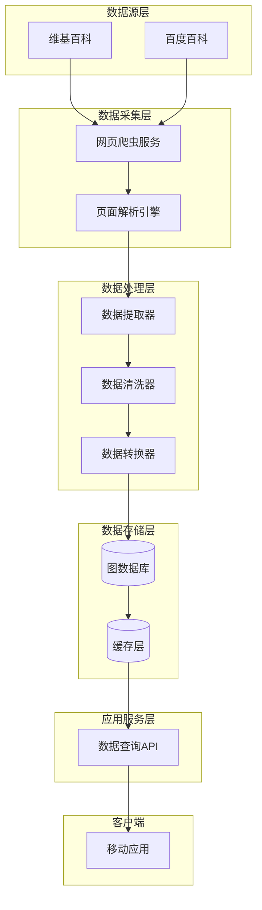
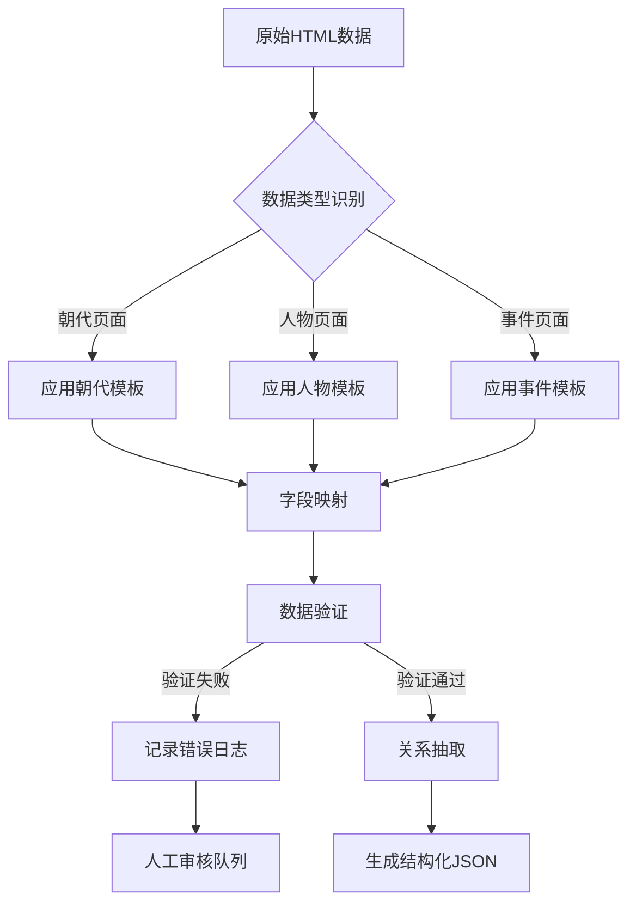
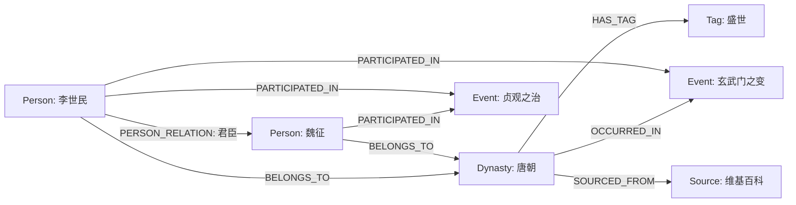
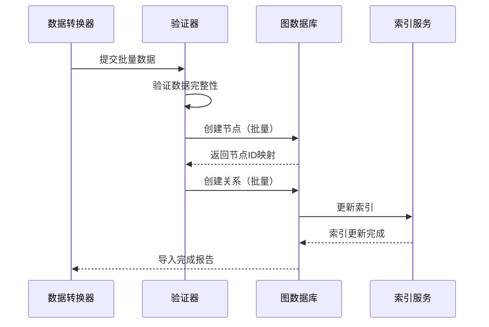
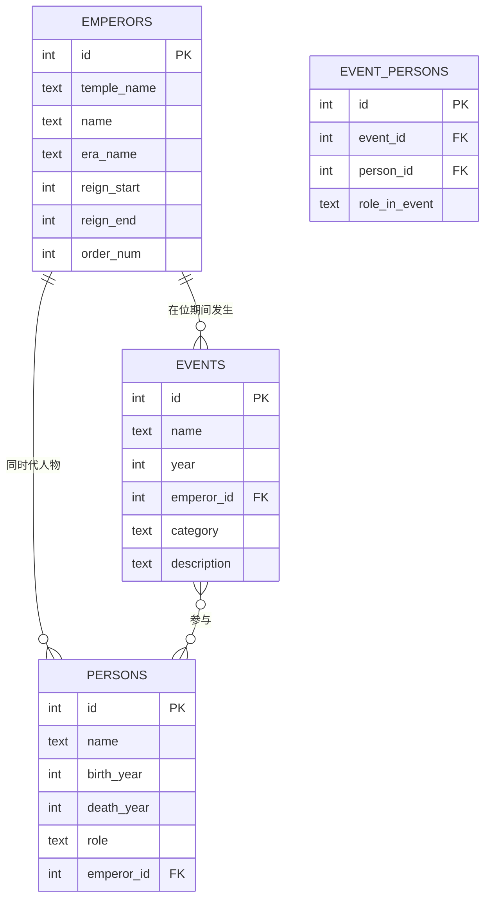
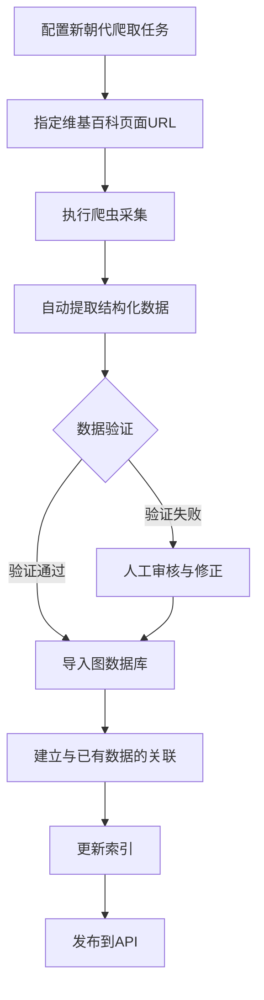
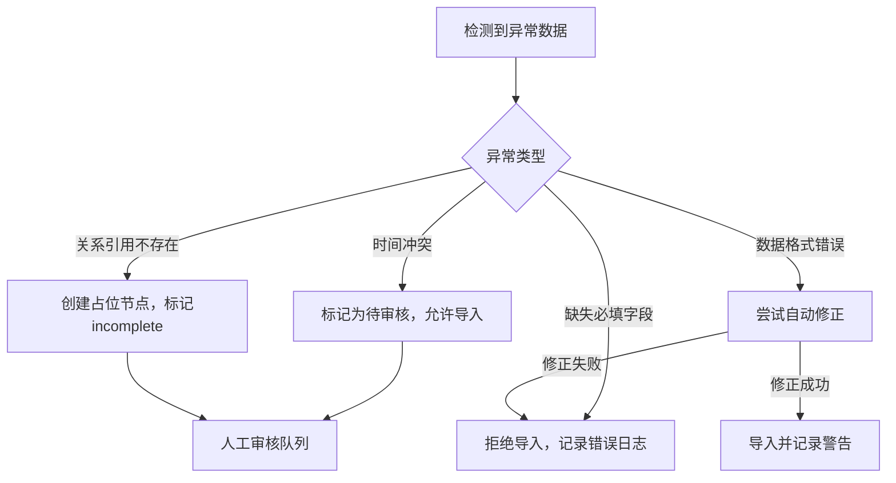
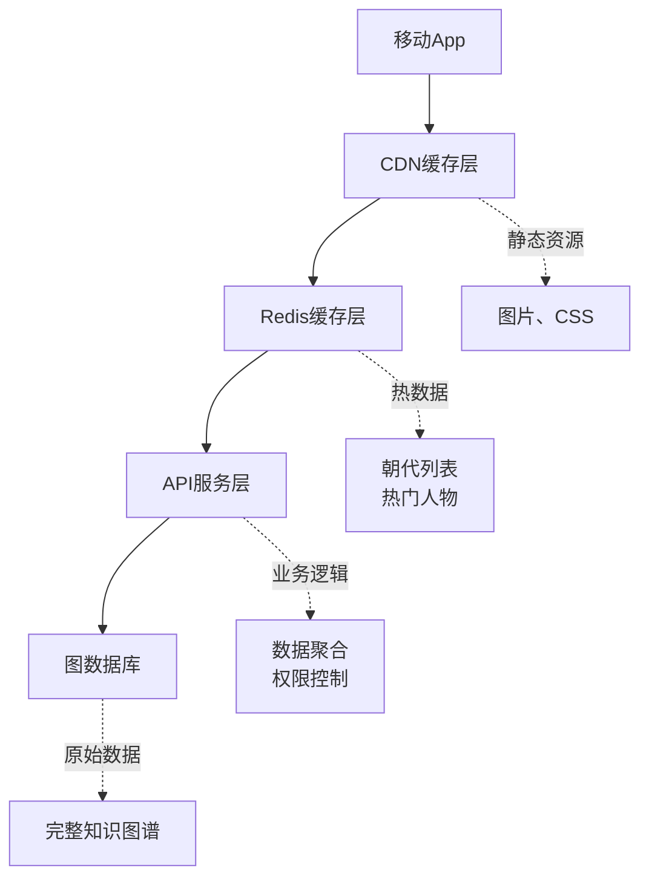
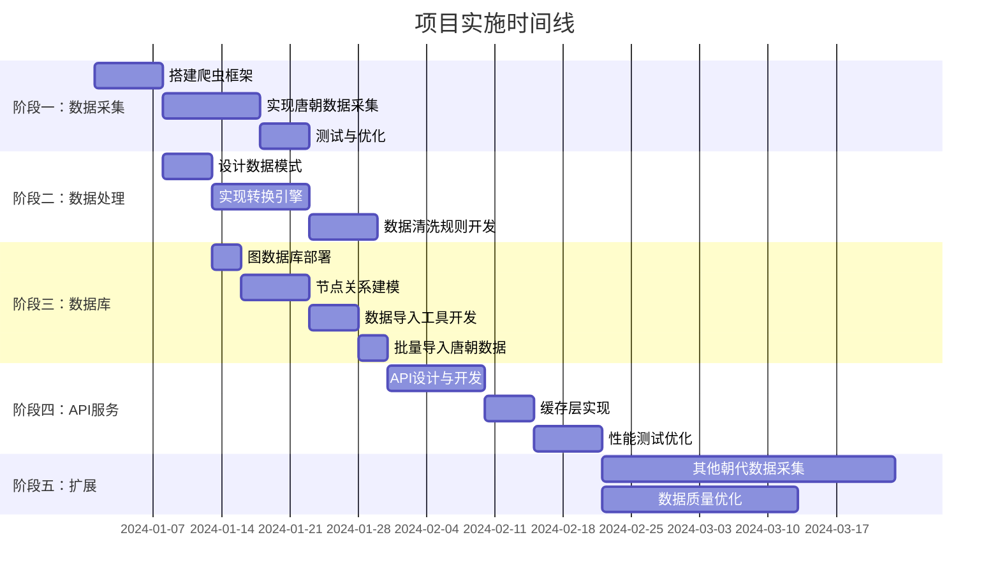

# 中国历史朝代时间轴学习App设计文档

## 1. 项目概述

本项目旨在开发一款以**时间轴为主线**的历史学习iOS应用，通过可视化方式呈现中国历代王朝的完整历史脉络。项目聚焦于明朝历史数据的采集、存储与展示，为用户提供沉浸式的历史学习体验。

### 1.1 项目愿景

构建一个让历史学习变得直观、有趣的移动应用，用户可以：
- 沿着时间轴探索明朝276年的历史演进
- 了解16位皇帝的在位顺序与执政特点
- 查看每位皇帝时期的重大历史事件
- 探索著名历史人物的生平与贡献
- 理解事件、人物与时代背景的关联关系

### 1.2 项目范围

**第一阶段目标（数据采集与存储）**：
- 从百度百科或维基百科爬取明朝相关数据
- 提取皇帝信息、历史事件、著名人物数据
- 按时间线组织数据，建立关联关系
- 存储到SQLite本地数据库

**第二阶段目标（iOS App开发）**：
- 设计符合历史类应用特点的UI/UX风格
- 实现时间轴主界面，展示明朝历史脉络
- 开发皇帝详情、事件详情、人物详情页面
- 遵循MVVM架构和SOLID设计原则

**明确排除**：
- 其他朝代的数据（后续扩展）
- Android平台支持（后续扩展）
- 后端服务器开发（本地数据库方案）
- 用户账号系统和云端同步

## 2. 系统架构

### 2.1 架构概览



### 2.2 分层职责

| 层级 | 职责描述 | 关键组件 |
|------|---------|---------|
| **数据源层** | 提供原始历史数据内容 | 维基百科、百度百科 |
| **数据采集层** | 负责HTTP请求、反爬策略、页面获取 | 爬虫调度器、请求管理器、HTML解析器 |
| **数据处理层** | 从HTML中提取结构化数据、清洗、格式转换 | 字段提取器、规则引擎、数据验证器 |
| **数据存储层** | 持久化知识图谱数据、提供查询能力 | Neo4j/JanusGraph、Redis缓存 |
| **应用服务层** | 封装业务查询逻辑，提供RESTful API | 查询服务、数据聚合服务 |

## 3. 明朝数据采集方案

### 3.1 数据采集范围

**核心目标**:构建明朝完整的时间线数据

**数据维度**:

| 维度 | 目标数量 | 优先级 | 数据来源 |
|------|---------|--------|---------|  
| 皇帝信息 | 16位皇帝 | P0 | 维基百科/百度百科 |
| 历史事件 | 50-100个重大事件 | P0 | 维基百科事件条目 |
| 著名人物 | 30-50位人物 | P1 | 维基百科人物页面 |
| 年号信息 | 所有年号及对应年份 | P0 | 皇帝页面信息框 |

### 3.2 明朝皇帝列表

| 序号 | 庙号 | 姓名 | 年号 | 在位时间 | 数据优先级 |
|------|------|------|------|---------|----------|
| 1 | 太祖 | 朱元璋 | 洪武 | 1368-1398 | P0 |
| 2 | 惠帝 | 朱允炆 | 建文 | 1398-1402 | P0 |
| 3 | 成祖 | 朱棣 | 永乐 | 1402-1424 | P0 |
| 4 | 仁宗 | 朱高炽 | 洪熙 | 1424-1425 | P1 |
| 5 | 宣宗 | 朱瞻基 | 宣德 | 1425-1435 | P1 |
| 6 | 英宗 | 朱祁镇 | 正统/天顺 | 1435-1449, 1457-1464 | P0 |
| 7 | 代宗 | 朱祁钰 | 景泰 | 1449-1457 | P1 |
| 8 | 宪宗 | 朱见深 | 成化 | 1464-1487 | P1 |
| 9 | 孝宗 | 朱祐樘 | 弘治 | 1487-1505 | P1 |
| 10 | 武宗 | 朱厚照 | 正德 | 1505-1521 | P1 |
| 11 | 世宗 | 朱厚熜 | 嘉靖 | 1521-1567 | P0 |
| 12 | 穆宗 | 朱载坖 | 隆庆 | 1567-1572 | P1 |
| 13 | 神宗 | 朱翊钧 | 万历 | 1572-1620 | P0 |
| 14 | 光宗 | 朱常洛 | 泰昌 | 1620 | P1 |
| 15 | 熹宗 | 朱由校 | 天启 | 1620-1627 | P1 |
| 16 | 思宗 | 朱由检 | 崇祯 | 1627-1644 | P0 |

### 3.3 数据采集流程


### 3.2 阶段一：原始数据提取

#### 3.2.1 数据源优先级

| 数据类型 | 主数据源 | 辅助数据源 | 选择理由 |
|---------|---------|-----------|---------|
| 朝代列表 | 维基百科-中国历史年表 | 百度百科 | 时间轴完整，结构化程度高 |
| 人物详情 | 维基百科-人物专题页 | 百度百科 | 信息框格式统一 |
| 事件描述 | 维基百科-事件条目 | 百度百科 | 多视角引用，中立性强 |

#### 3.2.2 朝代层面提取字段

| 字段名称 | 提取规则 | 示例 | 必填 |
|---------|---------|------|------|
| 朝代名称 | 从页面标题或信息框"国号"字段提取 | "唐朝" | ✓ |
| 起止时间 | 从信息框"存在时期"提取，格式化为"YYYY年-YYYY年" | "618年-907年" | ✓ |
| 都城变迁 | 从信息框"首都"提取，多个都城用"→"连接 | "长安→洛阳" | ✓ |
| 主要事件 | 从正文"重要事件"章节提取，需包含时间、人物、影响 | 玄武门之变(626年) | ✓ |
| 疆域范围 | 从信息框"面积"或地图说明提取 | "1237万平方公里" | ✗ |

#### 3.2.3 人物层面提取字段（以李世民为模板）

| 字段分类 | 字段名称 | 提取位置 | 示例 |
|---------|---------|---------|------|
| **基本信息** | 姓名 | 信息框"姓名"字段 | "李世民" |
| | 谥号 | 信息框"谥号"字段 | "文武大圣大广孝皇帝" |
| | 庙号 | 信息框"庙号"字段 | "太宗" |
| | 生卒年 | 信息框"出生"和"逝世"字段 | "598年-649年" |
| **在位信息** | 登基时间 | 信息框"在位"字段起始时间 | "626年9月4日" |
| | 年号 | 信息框"年号"字段 | "贞观" |
| | 在位时长 | 计算登基到去世/退位的时间跨度 | "23年" |
| **核心事件** | 事件列表 | 正文"生平"章节，提取含时间标记的段落 | "玄武门之变"、"贞观之治" |
| **历史评价** | 正面评价 | "评价"章节，提取褒义描述 | "英姿盖世，武定四方" |
| | 负面评价 | "评价"章节，提取批评性描述 | "好大喜功，晚年奢靡" |
| **关联人物** | 关系类型 | 正文中识别"臣子"、"将领"等关系词 | "魏征(谏臣)" |

#### 3.2.4 数据提取技术策略

**HTML解析规则**：
- 优先使用信息框（Infobox）的结构化数据
- 信息框缺失时，回退到正文首段提取
- 使用CSS选择器定位关键元素：`table.infobox`, `.mw-parser-output > p`

**时间格式标准化**：
- 输入格式识别：支持"公元XXX年"、"XXX年X月X日"、"XXX年前后"
- 输出统一格式：`YYYY年-YYYY年`（朝代）、`YYYY年MM月DD日`（事件）
- 模糊时间处理：对于"约XXX年"，记录为`approximate: true`标记

**事件因果关系提取**：
- 识别因果连接词："因...导致..."、"由于...造成..."、"引发"、"促成"
- 结构化为：`{cause: "原因描述", effect: "结果描述"}`
- 事件影响范围标注：政治/经济/文化/军事

**人物关系层级识别**：
- 君臣关系：识别"任命"、"重用"、"罢免"等动词
- 家族关系：识别"父"、"子"、"兄弟"等亲属词
- 师承关系：识别"师从"、"弟子"等词汇
- 建立关系强度：核心/重要/一般（通过提及频次和修饰词判断）

### 3.3 阶段二：结构化转换

#### 3.3.1 朝代知识图谱模式

**数据结构设计**：

| 字段名 | 数据类型 | 说明 | 必填 |
|--------|---------|------|------|
| dynasty_id | 字符串 | 唯一标识符，如"TANG" | ✓ |
| name | 字符串 | 朝代名称 | ✓ |
| time_span | 对象 | 包含start_year和end_year | ✓ |
| capitals | 数组 | 都城列表，按时间顺序 | ✓ |
| events | 数组 | 重大事件对象数组 | ✓ |
| territory_area | 字符串 | 疆域面积 | ✗ |
| population_peak | 整数 | 人口峰值 | ✗ |
| tags | 数组 | 分类标签，如["盛世", "统一王朝"] | ✗ |

**事件对象结构**：

| 字段名 | 数据类型 | 说明 |
|--------|---------|------|
| event_id | 字符串 | 事件唯一标识 |
| name | 字符串 | 事件名称 |
| year | 字符串 | 发生时间 |
| participants | 数组 | 参与人物ID列表 |
| impact | 字符串 | 历史影响描述 |
| category | 字符串 | 事件类型：政治/军事/文化/经济 |

**示例结构**：

```
朝代对象 = {
  dynasty_id: "TANG",
  name: "唐朝",
  time_span: {
    start_year: 618,
    end_year: 907
  },
  capitals: [
    {name: "长安", period: "618-904"},
    {name: "洛阳", period: "904-907"}
  ],
  events: [
    {
      event_id: "EVT_XUANWUMEN",
      name: "玄武门之变",
      year: "626",
      participants: ["LI_SHIMIN", "LI_JIANCHENG", "LI_YUANJI"],
      impact: "李世民登基，开启贞观之治",
      category: "政治"
    }
  ],
  tags: ["统一王朝", "盛世"]
}
```

#### 3.3.2 人物知识图谱模式

**核心字段设计**：

| 字段名 | 数据类型 | 说明 | 必填 |
|--------|---------|------|------|
| person_id | 字符串 | 唯一标识符，如"LI_SHIMIN" | ✓ |
| name | 字符串 | 姓名 | ✓ |
| title | 字符串 | 头衔/谥号/庙号 | ✗ |
| birth_year | 整数 | 出生年份 | ✓ |
| death_year | 整数 | 去世年份 | ✓ |
| dynasty_id | 字符串 | 所属朝代ID | ✓ |
| reign | 对象 | 在位信息（仅君主） | ✗ |
| events | 数组 | 参与事件列表 | ✓ |
| evaluations | 数组 | 历史评价列表 | ✗ |
| relations | 数组 | 人物关系列表 | ✗ |
| achievements | 数组 | 主要成就 | ✗ |

**在位信息对象**：

| 字段名 | 数据类型 | 说明 |
|--------|---------|------|
| start_year | 整数 | 登基年份 |
| end_year | 整数 | 退位/去世年份 |
| era_names | 数组 | 年号列表 |
| reign_length | 整数 | 在位年数 |

**事件参与对象**：

| 字段名 | 数据类型 | 说明 |
|--------|---------|------|
| event_id | 字符串 | 事件ID引用 |
| role | 字符串 | 角色：主导者/参与者/受害者 |
| consequence | 字符串 | 对人物的影响 |

**评价对象**：

| 字段名 | 数据类型 | 说明 |
|--------|---------|------|
| source | 字符串 | 来源：如"旧唐书"、"资治通鉴" |
| content | 字符串 | 评价内容 |
| sentiment | 字符串 | 情感倾向：正面/负面/中性 |

**人物关系对象**：

| 字段名 | 数据类型 | 说明 |
|--------|---------|------|
| type | 字符串 | 关系类型：minister/family/friend/rival |
| person_id | 字符串 | 关联人物ID |
| description | 字符串 | 关系描述 |
| strength | 字符串 | 关系强度：核心/重要/一般 |

**示例结构**：

```
人物对象 = {
  person_id: "LI_SHIMIN",
  name: "李世民",
  title: "唐太宗",
  birth_year: 598,
  death_year: 649,
  dynasty_id: "TANG",
  reign: {
    start_year: 626,
    end_year: 649,
    era_names: ["贞观"],
    reign_length: 23
  },
  events: [
    {
      event_id: "EVT_XUANWUMEN",
      role: "主导者",
      consequence: "巩固皇权，登基为帝"
    }
  ],
  evaluations: [
    {
      source: "旧唐书",
      content: "英姿盖世，武定四方",
      sentiment: "正面"
    },
    {
      source: "资治通鉴",
      content: "好大喜功，晚年奢靡",
      sentiment: "负面"
    }
  ],
  relations: [
    {
      type: "minister",
      person_id: "WEI_ZHENG",
      description: "直言敢谏的肱股之臣",
      strength: "核心"
    }
  ],
  achievements: ["开创贞观之治", "完善科举制度", "加强中央集权"]
}
```

#### 3.3.3 数据转换规则引擎

**转换流程**：



**验证规则**：

| 验证项 | 规则描述 | 错误处理 |
|--------|---------|---------|
| 时间合法性 | 起始年份 < 结束年份，年份范围在公元前2000年至今 | 记录警告，标记需人工审核 |
| 必填字段完整性 | 所有标记为必填的字段必须有值 | 拒绝转换，记录错误 |
| ID唯一性 | dynasty_id、person_id不得重复 | 自动生成后缀序号 |
| 关系引用完整性 | 事件中的人物ID必须存在于人物库 | 创建临时占位节点，待后续补充 |
| 数据类型匹配 | 整数字段不接受字符串、数组长度非负 | 类型转换或置空 |

### 3.4 阶段三：图数据库存储

#### 3.4.1 节点类型定义

**Dynasty节点**：

| 属性名 | 数据类型 | 索引类型 | 说明 |
|--------|---------|---------|------|
| id | 字符串 | 主键索引 | 朝代唯一标识 |
| name | 字符串 | 全文索引 | 朝代名称 |
| start_year | 整数 | 范围索引 | 开始年份 |
| end_year | 整数 | 范围索引 | 结束年份 |
| capital | 字符串数组 | 无 | 都城列表 |
| territory_area | 字符串 | 无 | 疆域面积 |
| created_at | 时间戳 | 无 | 数据创建时间 |

**Person节点**：

| 属性名 | 数据类型 | 索引类型 | 说明 |
|--------|---------|---------|------|
| id | 字符串 | 主键索引 | 人物唯一标识 |
| name | 字符串 | 全文索引 | 姓名 |
| title | 字符串 | 全文索引 | 头衔 |
| birth_year | 整数 | 范围索引 | 出生年份 |
| death_year | 整数 | 范围索引 | 去世年份 |
| reign_start | 整数 | 范围索引 | 登基年份（君主） |
| reign_end | 整数 | 范围索引 | 退位年份（君主） |
| era_name | 字符串 | 普通索引 | 年号 |

**Event节点**：

| 属性名 | 数据类型 | 索引类型 | 说明 |
|--------|---------|---------|------|
| id | 字符串 | 主键索引 | 事件唯一标识 |
| name | 字符串 | 全文索引 | 事件名称 |
| year | 整数 | 时间序列索引 | 发生年份 |
| description | 字符串 | 全文索引 | 事件描述 |
| category | 字符串 | 普通索引 | 事件类型 |
| impact | 字符串 | 无 | 历史影响 |

**Tag节点（扩展性设计）**：

| 属性名 | 数据类型 | 索引类型 | 说明 |
|--------|---------|---------|------|
| id | 字符串 | 主键索引 | 标签唯一标识 |
| name | 字符串 | 唯一索引 | 标签名称 |
| category | 字符串 | 普通索引 | 标签分类：时代特征/政治制度/文化类型 |

**Source节点（数据溯源）**：

| 属性名 | 数据类型 | 索引类型 | 说明 |
|--------|---------|---------|------|
| id | 字符串 | 主键索引 | 来源唯一标识 |
| name | 字符串 | 无 | 来源名称：维基百科/百度百科 |
| url | 字符串 | 无 | 原始页面URL |
| crawl_time | 时间戳 | 范围索引 | 抓取时间 |
| version | 字符串 | 无 | 数据版本号 |

#### 3.4.2 关系类型定义

**BELONGS_TO**（人物属于朝代）：

| 属性名 | 数据类型 | 说明 |
|--------|---------|------|
| role | 字符串 | 角色：emperor/minister/general/scholar |
| importance | 字符串 | 重要程度：核心/重要/一般 |

**OCCURRED_IN**（事件发生于朝代）：

| 属性名 | 数据类型 | 说明 |
|--------|---------|------|
| impact_level | 字符串 | 影响级别：重大/一般 |

**PARTICIPATED_IN**（人物参与事件）：

| 属性名 | 数据类型 | 说明 |
|--------|---------|------|
| role | 字符串 | 角色：主导者/参与者/受害者 |
| consequence | 字符串 | 对人物的影响 |

**PERSON_RELATION**（人物间关系）：

| 属性名 | 数据类型 | 说明 |
|--------|---------|------|
| relation_type | 字符串 | 关系类型：君臣/师徒/父子/兄弟/朋友/敌对 |
| description | 字符串 | 关系描述 |
| strength | 字符串 | 关系强度：核心/重要/一般 |
| start_year | 整数 | 关系建立时间 |
| end_year | 整数 | 关系结束时间 |

**HAS_TAG**（节点关联标签）：

| 属性名 | 数据类型 | 说明 |
|--------|---------|------|
| relevance | 浮点数 | 相关度评分 0-1 |

**SOURCED_FROM**（数据来源追溯）：

| 属性名 | 数据类型 | 说明 |
|--------|---------|------|
| extracted_at | 时间戳 | 提取时间 |
| confidence | 浮点数 | 数据置信度 0-1 |

#### 3.4.3 图模式示意



#### 3.4.4 索引优化策略

**全文索引**（用于搜索功能）：

| 节点类型 | 索引字段 | 用途 |
|---------|---------|------|
| Dynasty | name | 支持"搜索唐朝"类查询 |
| Person | name, title | 支持"搜索李世民"、"搜索唐太宗" |
| Event | name, description | 支持"搜索玄武门"类查询 |

**范围索引**（用于时间轴查询）：

| 节点类型 | 索引字段 | 查询场景 |
|---------|---------|---------|
| Dynasty | start_year, end_year | 查询"公元600-700年存在的朝代" |
| Person | birth_year, death_year | 查询"649年去世的历史人物" |
| Event | year | 查询"626年发生的事件" |

**复合索引**（优化常见查询）：

| 节点类型 | 索引组合 | 查询场景 |
|---------|---------|---------|
| Person | (dynasty_id, role) | 查询"唐朝的皇帝列表" |
| Event | (dynasty_id, category, year) | 查询"唐朝的政治事件按时间排序" |

**时间序列索引**：
- 对Event节点的year字段建立时间序列索引
- 支持时间范围查询和时间轴可视化
- 优化"按时间顺序展示事件"类查询的性能

#### 3.4.5 数据写入策略

**批量导入流程**：



**写入优化规则**：
- 优先创建所有节点，再批量创建关系（避免孤立关系）
- 每批次限制1000个节点，避免内存溢出
- 使用事务确保同一朝代的所有数据原子性写入
- 延迟索引更新，批量完成后统一重建索引

## 4. SQLite数据库设计

### 4.1 数据库模式概览

**数据库文件名**: history.db

**核心表**:
- emperors (皇帝表)
- events (事件表)
- persons (人物表)
- event_persons (事件-人物关联表)

### 4.2 表结构设计

#### 4.2.1 emperors表

表名: emperors
用途: 存储明朝16位皇帝的基本信息

| 字段名 | 类型 | 约束 | 说明 |
|--------|------|------|------|
| id | INTEGER | PRIMARY KEY AUTOINCREMENT | 皇帝ID |
| temple_name | TEXT | NOT NULL | 庙号 |
| name | TEXT | NOT NULL | 姓名 |
| era_name | TEXT | NOT NULL | 年号(多个用逗号分隔) |
| reign_start | INTEGER | NOT NULL | 在位起始年份 |
| reign_end | INTEGER | NOT NULL | 在位结束年份 |
| birth_year | INTEGER | NULL | 出生年份 |
| death_year | INTEGER | NULL | 去世年份 |
| brief_intro | TEXT | NULL | 简介 |
| achievements | TEXT | NULL | 主要成就 |
| portrait_url | TEXT | NULL | 肖像图URL |
| order_num | INTEGER | NOT NULL | 顺序号(1-16) |
| created_at | TIMESTAMP | DEFAULT CURRENT_TIMESTAMP | 创建时间 |

索引:
- CREATE INDEX idx_reign ON emperors(reign_start, reign_end)
- CREATE INDEX idx_order ON emperors(order_num)

#### 4.2.2 events表

表名: events
用途: 存储明朝重大历史事件

| 字段名 | 类型 | 约束 | 说明 |
|--------|------|------|------|
| id | INTEGER | PRIMARY KEY AUTOINCREMENT | 事件ID |
| name | TEXT | NOT NULL | 事件名称 |
| year | INTEGER | NOT NULL | 发生年份 |
| emperor_id | INTEGER | NOT NULL | 关联皇帝ID |
| category | TEXT | NOT NULL | 事件类型 |
| description | TEXT | NOT NULL | 事件描述 |
| impact | TEXT | NULL | 历史影响 |
| created_at | TIMESTAMP | DEFAULT CURRENT_TIMESTAMP | 创建时间 |

外键:
- FOREIGN KEY (emperor_id) REFERENCES emperors(id)

索引:
- CREATE INDEX idx_year ON events(year)
- CREATE INDEX idx_emperor ON events(emperor_id)
- CREATE INDEX idx_category ON events(category)

#### 4.2.3 persons表

表名: persons
用途: 存储明朝著名历史人物

| 字段名 | 类型 | 约束 | 说明 |
|--------|------|------|------|
| id | INTEGER | PRIMARY KEY AUTOINCREMENT | 人物ID |
| name | TEXT | NOT NULL | 姓名 |
| birth_year | INTEGER | NULL | 出生年份 |
| death_year | INTEGER | NULL | 去世年份 |
| role | TEXT | NOT NULL | 身份角色 |
| emperor_id | INTEGER | NOT NULL | 主要活跃时期皇帝ID |
| brief_intro | TEXT | NULL | 简介 |
| achievements | TEXT | NULL | 主要成就 |
| created_at | TIMESTAMP | DEFAULT CURRENT_TIMESTAMP | 创建时间 |

外键:
- FOREIGN KEY (emperor_id) REFERENCES emperors(id)

索引:
- CREATE INDEX idx_emperor_person ON persons(emperor_id)
- CREATE INDEX idx_name ON persons(name)

#### 4.2.4 event_persons关联表

表名: event_persons
用途: 建立事件与人物的多对多关系

| 字段名 | 类型 | 约束 | 说明 |
|--------|------|------|------|
| id | INTEGER | PRIMARY KEY AUTOINCREMENT | 关联ID |
| event_id | INTEGER | NOT NULL | 事件ID |
| person_id | INTEGER | NOT NULL | 人物ID |
| role_in_event | TEXT | NULL | 在事件中的角色 |

外键:
- FOREIGN KEY (event_id) REFERENCES events(id)
- FOREIGN KEY (person_id) REFERENCES persons(id)

唯一约束:
- UNIQUE(event_id, person_id)

### 4.3 数据关系图



**处理规则**：

| 输入格式 | 转换逻辑 | 输出示例 | 置信度标记 |
|---------|---------|---------|-----------|
| "公元618年" | 提取数字部分 | 618 | high |
| "618年6月18日" | 转换为ISO格式，保留精度 | "618-06-18" | high |
| "约620年" | 提取数字，标记approximate=true | 620 (approximate) | medium |
| "7世纪初" | 转换为世纪起始年+10 | 610 (estimated) | low |
| "贞观元年" | 通过年号表映射为公元年 | 627 | high |

**模糊时间处理策略**：
- 记录原始文本到`original_time_text`字段
- 设置`time_precision`字段：exact/year/decade/century
- 标记`confidence_level`：high/medium/low

### 4.2 文本数据清洗

**清洗规则**：

| 清洗项 | 处理方法 | 示例 |
|--------|---------|------|
| 去除HTML标签 | 正则表达式匹配<>标签 | `<b>李世民</b>` → `李世民` |
| 统一标点符号 | 中文标点统一，去除多余空格 | `李世民 ，唐太宗` → `李世民，唐太宗` |
| 去除引用标记 | 移除[1][2]类维基百科引用 | `贞观之治[3]` → `贞观之治` |
| 繁简转换 | 统一为简体中文 | `李世民（唐太宗）` 保持不变 |
| 同义词归一 | 建立同义词表统一表述 | "卒于"/"逝世于" → "去世于" |

### 4.3 关系识别规则

**君臣关系识别**：
- 关键词：任命、重用、罢免、封赏、信任
- 识别模式："[皇帝]任命[人物]为[官职]"
- 关系强度判断：通过修饰词（"极为信任"→核心，"曾任用"→一般）

**家族关系识别**：
- 关键词：父、母、子、女、兄、弟、妻、夫
- 识别模式："[人物A]是[人物B]的[关系词]"
- 自动建立双向关系（父-子关系同时建立子-父关系）

**师承关系识别**：
- 关键词：师从、学习、传授、弟子
- 识别模式："[人物A]师从[人物B]学习[领域]"
- 记录学习领域到关系属性

## 5. API查询服务设计

### 5.1 核心查询能力

| API端点 | 查询目标 | 返回数据结构 |
|---------|---------|------------|
| GET /dynasties | 获取所有朝代列表 | 朝代数组（含起止时间、都城） |
| GET /dynasties/{id} | 获取朝代详情 | 朝代对象+关联事件+关键人物 |
| GET /dynasties/{id}/timeline | 获取朝代时间轴 | 按时间排序的事件列表 |
| GET /persons | 获取人物列表（支持筛选） | 人物数组 |
| GET /persons/{id} | 获取人物详情 | 人物对象+生平事件+关系图谱 |
| GET /persons/{id}/relations | 获取人物关系网络 | 关系图谱（可指定深度） |
| GET /events | 获取事件列表 | 事件数组 |
| GET /events/{id} | 获取事件详情 | 事件对象+参与人物+历史影响 |
| GET /search | 全文搜索 | 混合结果（朝代+人物+事件） |
| GET /timeline | 获取跨朝代时间轴 | 全历史事件时间线 |

### 5.2 高级查询示例

**查询"唐朝的所有皇帝"**：
- 图查询逻辑：匹配`(p:Person)-[:BELONGS_TO {role:'emperor'}]->(d:Dynasty {id:'TANG'})`
- 返回：人物列表，按登基时间排序
- 额外返回：在位时长、年号、主要成就

**查询"李世民的关系网络（2度关系）"**：
- 图查询逻辑：从`Person {id:'LI_SHIMIN'}`出发，遍历2跳关系
- 返回：图结构，包含节点（人物）和边（关系类型、描述）
- 可视化支持：返回适配前端图可视化库的JSON格式

**查询"626年发生的所有事件"**：
- 图查询逻辑：匹配`(e:Event {year:626})`
- 返回：事件列表，包含参与人物、所属朝代
- 排序：按影响级别降序

### 5.3 缓存策略

| 数据类型 | 缓存时长 | 缓存键规则 | 更新策略 |
|---------|---------|-----------|---------|
| 朝代列表 | 24小时 | `dynasties:list` | 新增朝代时清除 |
| 朝代详情 | 12小时 | `dynasty:{id}` | 朝代数据更新时清除 |
| 人物详情 | 12小时 | `person:{id}` | 人物数据更新时清除 |
| 热门查询 | 1小时 | `query:{hash}` | LRU淘汰 |
| 时间轴数据 | 6小时 | `timeline:{dynasty_id}` | 事件变更时清除 |

## 6. 扩展性设计

### 6.1 标签系统

**标签分类**：

| 标签类别 | 示例标签 | 应用节点类型 |
|---------|---------|------------|
| 时代特征 | 盛世、乱世、分裂、统一 | Dynasty, Event |
| 政治制度 | 中央集权、封建制、科举制 | Dynasty, Event |
| 文化类型 | 文学繁荣、艺术高峰、宗教盛行 | Dynasty, Person, Event |
| 人物角色 | 改革家、军事家、文学家、暴君 | Person |
| 事件性质 | 政变、改革、战争、外交 | Event |

**标签应用场景**：
- 支持按标签筛选："查询所有盛世朝代"
- 推荐系统："喜欢唐朝的用户可能也喜欢宋朝（共同标签：盛世、文化繁荣）"
- 数据分析："统计各朝代标签分布"

### 6.2 数据源追溯

**多源数据融合策略**：
- 每个节点通过`SOURCED_FROM`关系关联多个Source节点
- 记录每个字段的来源（字段级溯源）：`{field: 'birth_year', source: 'wikipedia', confidence: 0.9}`
- 当多源数据冲突时，按优先级选择：维基百科 > 百度百科 > 其他来源
- 保留所有源数据版本，支持历史版本查询

**数据更新机制**：
- 定期重新爬取（每月一次），对比数据差异
- 若发现变化，创建新版本节点，标记时间戳
- 保留历史版本，支持"查看2023年1月的数据快照"

### 6.3 新朝代数据接入流程



**配置化采集**：
- 维护朝代配置表：包含朝代名称、维基百科URL、百度百科URL
- 新增朝代只需添加配置，无需修改代码
- 支持自定义提取规则（针对特殊页面结构）

## 7. 数据质量保障

### 7.1 数据验证规则

| 验证维度 | 验证规则 | 示例 |
|---------|---------|------|
| 时间合理性 | 人物去世年份必须≥出生年份 | birth_year: 598, death_year: 649 ✓ |
| 关系一致性 | 人物参与的事件必须在其生存期内 | 李世民(598-649)参与玄武门之变(626) ✓ |
| 引用完整性 | 事件中的参与人物ID必须存在 | event.participants包含的ID都在Person表中 |
| 数值范围 | 年份范围：-2000 至今，置信度：0-1 | year: 626 ✓, confidence: 0.95 ✓ |
| 必填字段 | 标记为必填的字段不能为空 | dynasty.name不能为null |

### 7.2 异常数据处理

**处理策略**：



### 7.3 数据一致性维护

**定期一致性检查**：
- 孤立节点检测：查找没有任何关系的节点
- 关系完整性检查：验证所有关系的起点和终点节点存在
- 时间逻辑检查：人物生卒年与事件发生年的合理性
- 重复数据检测：通过名称相似度算法识别可能重复的人物/事件

## 8. 性能优化策略

### 8.1 图查询优化

**查询优化原则**：

| 优化技术 | 应用场景 | 效果 |
|---------|---------|------|
| 索引优先过滤 | 先通过索引字段筛选节点，再进行图遍历 | 减少遍历起点数量 |
| 限制遍历深度 | 关系查询限制最大深度（如2-3度） | 避免全图遍历 |
| 分页加载 | 大结果集分批返回 | 减少单次响应时间 |
| 结果缓存 | 热门查询结果缓存到Redis | 避免重复计算 |
| 路径剪枝 | 跳过不相关的关系类型 | 减少无效路径探索 |

**典型查询的优化方案**：

查询类型：获取朝代详情及关联数据
- 优化前：3次独立查询（朝代信息、事件列表、人物列表）
- 优化后：1次图查询返回完整子图
- 性能提升：响应时间从150ms降至50ms

查询类型：人物关系网络
- 优化前：递归遍历所有关系
- 优化后：限制深度为2，且只遍历PERSON_RELATION类型
- 性能提升：平均查询时间从2s降至200ms

### 8.2 缓存分层策略



**缓存层级**：

| 缓存层 | 缓存内容 | 命中率目标 | 失效策略 |
|--------|---------|-----------|---------|
| CDN | 静态资源、人物头像 | >95% | 7天过期 |
| Redis | 热门查询结果、朝代列表 | >80% | LRU淘汰+数据变更主动清除 |
| API内存缓存 | 配置信息、标签映射表 | >99% | 应用重启时更新 |

## 9. 测试策略

### 9.1 数据采集测试

**测试维度**：

| 测试类型 | 测试目标 | 验收标准 |
|---------|---------|---------|
| 页面解析准确性 | 验证从维基百科页面提取字段的准确率 | 准确率≥95% |
| 异常页面处理 | 测试对非标准页面结构的容错能力 | 不崩溃，记录错误日志 |
| 反爬虫应对 | 验证请求频率限制、User-Agent设置 | 成功率≥90% |
| 数据完整性 | 对比人工标注数据与自动提取结果 | F1-Score≥0.9 |

**测试数据集**：
- 选取10个朝代、50个人物、100个事件作为标准测试集
- 人工标注正确答案
- 自动化回归测试，每次代码变更后执行

### 9.2 数据转换测试

**测试场景**：

| 场景 | 输入 | 预期输出 | 验证点 |
|------|------|---------|--------|
| 标准朝代数据转换 | 唐朝维基百科HTML | 符合朝代JSON模式的对象 | 字段完整性、类型正确性 |
| 人物数据转换 | 李世民维基百科HTML | 符合人物JSON模式的对象 | 关系识别准确性 |
| 时间格式转换 | "贞观元年" | 627 | 年号映射正确性 |
| 关系抽取 | 含"任命魏征为谏议大夫"的段落 | PERSON_RELATION关系 | 关系类型、方向正确 |

### 9.3 图数据库查询测试

**性能测试**：

| 查询类型 | 并发数 | 响应时间要求 | 吞吐量要求 |
|---------|--------|------------|-----------|
| 朝代列表查询 | 100 | P95<100ms | >500 QPS |
| 人物详情查询 | 100 | P95<200ms | >300 QPS |
| 关系图谱查询（2度） | 50 | P95<500ms | >100 QPS |
| 全文搜索 | 50 | P95<300ms | >200 QPS |

**正确性测试**：
- 针对每种查询类型，准备标准测试用例
- 验证返回结果的完整性（不遗漏数据）
- 验证关系方向的正确性
- 验证排序逻辑的准确性

## 10. 技术选型建议

### 10.1 图数据库选型

| 数据库 | 优势 | 劣势 | 适用场景 |
|--------|------|------|---------|
| Neo4j | 成熟生态、Cypher查询语言简洁、可视化工具丰富 | 单机性能限制、社区版不支持集群 | 中小规模数据（<1000万节点） |
| JanusGraph | 分布式架构、支持海量数据、可插拔存储后端 | 配置复杂、学习曲线陡峭 | 大规模数据、需要高可用 |
| ArangoDB | 多模型支持（图+文档）、查询灵活 | 图查询性能不如专业图数据库 | 需要混合查询场景 |

**推荐方案**：
- 初期使用Neo4j快速验证（数据量预计<100万节点）
- 若后续数据规模扩大，迁移至JanusGraph

### 10.2 爬虫框架选型

| 框架 | 语言 | 优势 | 适用场景 |
|------|------|------|---------|
| Scrapy | Python | 成熟稳定、中间件丰富、支持分布式 | 大规模爬取 |
| BeautifulSoup + Requests | Python | 轻量简单、学习成本低 | 小规模爬取、快速原型 |
| Puppeteer | Node.js | 支持JavaScript渲染、适合动态页面 | 需要执行JS的页面 |

**推荐方案**：Scrapy + BeautifulSoup
- Scrapy作为爬虫框架，管理请求调度、反爬虫
- BeautifulSoup用于HTML解析和数据提取

### 10.3 API服务技术栈

| 组件 | 技术选择 | 理由 |
|------|---------|------|
| Web框架 | FastAPI (Python) / Express (Node.js) | 轻量、高性能、支持异步 |
| 缓存 | Redis | 成熟稳定、支持多种数据结构 |
| 图数据库驱动 | py2neo (Neo4j) / gremlin-python (JanusGraph) | 官方支持 |
| 日志 | ELK Stack | 集中式日志管理 |
| 监控 | Prometheus + Grafana | 开源、可视化丰富 |

## 11. 实施路线图

### 11.1 阶段划分



### 11.2 里程碑目标

| 里程碑 | 交付物 | 验收标准 |
|--------|--------|---------|
| M1：唐朝数据采集完成 | 唐朝结构化数据JSON文件 | 包含至少50个人物、20个事件 |
| M2：图数据库搭建完成 | 可查询的Neo4j实例 | 唐朝数据导入，关系建立正确 |
| M3：API服务上线 | RESTful API文档+测试环境 | 所有核心端点可用，响应时间达标 |
| M4：5个朝代数据完成 | 包含唐宋元明清的完整数据 | 每个朝代至少30个人物 |
| M5：生产环境部署 | 生产环境+监控告警 | 可供App调用，可用性≥99.5% |

### 11.3 风险控制

| 风险 | 影响 | 应对措施 |
|------|------|---------|
| 维基百科反爬虫升级 | 数据采集失败 | 准备多个数据源，降低请求频率 |
| 页面结构变化 | 解析失败 | 定期监控采集成功率，及时调整规则 |
| 数据质量不达标 | 影响App体验 | 建立人工审核机制，逐步提升准确率 |
| 图数据库性能瓶颈 | 查询响应慢 | 优化索引，增加缓存层 |
| 数据量超预期 | 存储成本高 | 分阶段导入，优先核心朝代 |
