# 历史时间轴学习App - 完整设计文档

## 一、项目概述

### 1.1 项目愿景
开发一款以时间轴为主线的中国历史学习App，通过结构化数据呈现历代王朝的皇帝世系、重大事件及关键人物，实现历史脉络的可视化学习。

### 1.2 项目目标
- 构建完整的明朝历史知识图谱，包含皇帝、事件、人物及其关联关系
- 通过网络爬虫从百度百科和维基百科获取高质量历史数据
- 建立可扩展的数据存储架构，支持后续朝代的快速接入
- 提供RESTful API服务，支持灵活的数据查询和访问
- 打造符合历史主题的iOS客户端，以时间线方式呈现历史脉络

### 1.3 项目范围
- **阶段一（当前）**: 明朝历史数据的获取、存储和展示
- **阶段二（未来）**: 扩展至其他朝代，形成完整的中国历史体系

### 1.4 技术栈概览

| 模块 | 技术选型 | 说明 |
|------|---------|------|
| 数据爬取 | Python 3.9+, Scrapy, BeautifulSoup4 | 爬虫框架和HTML解析 |
| 数据存储 | SQLite + Neo4j | 关系型数据 + 图数据库 |
| API服务 | FastAPI, Uvicorn | 高性能异步API框架 |
| 客户端 | Swift 5.0+, SwiftUI | iOS原生开发 |
| 架构模式 | MVVM + SOLID | 客户端架构原则 |

## 二、系统架构设计

### 2.1 整体架构

系统采用三层架构，各层职责清晰分离：

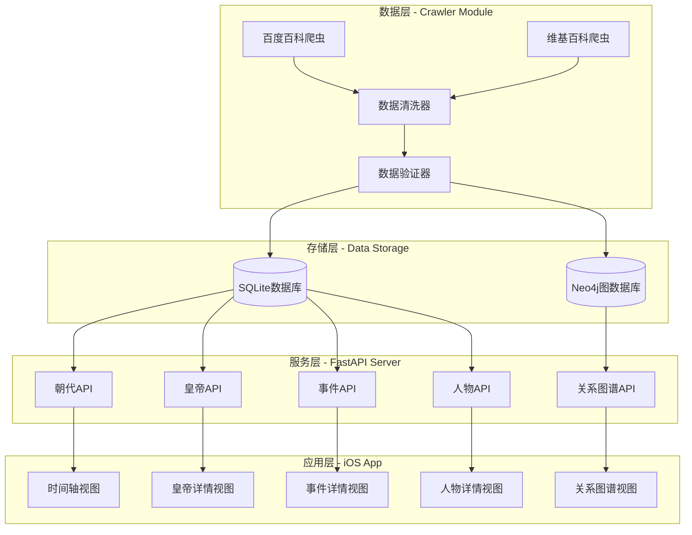

### 2.2 项目目录结构

```
HistoryGogo/
├── crawler/                    # 数据爬取脚本目录
│   ├── spiders/               # 爬虫实现
│   ├── pipelines/             # 数据处理管道
│   ├── models/                # 数据模型定义
│   ├── utils/                 # 工具函数
│   └── config/                # 爬虫配置
├── server/                    # FastAPI服务器目录
│   ├── api/                   # API路由
│   ├── services/              # 业务逻辑层
│   ├── repositories/          # 数据访问层
│   ├── models/                # 数据模型
│   ├── schemas/               # API Schema定义
│   └── database/              # 数据库连接配置
├── ios-app/                   # iOS客户端目录
│   ├── Models/                # 数据模型
│   ├── ViewModels/            # 视图模型（MVVM）
│   ├── Views/                 # 视图层
│   ├── Services/              # 网络服务
│   └── Utils/                 # 工具类
└── resources/                 # 资源文件目录
```

## 三、数据爬取模块设计

### 3.1 爬取策略

#### 3.1.1 双源爬取策略

采用百度百科和维基百科双数据源策略，确保数据的完整性和准确性：

| 数据源 | 优先级 | 优势 | 爬取内容 |
|--------|--------|------|----------|
| 百度百科 | 主数据源 | 访问稳定、中文内容丰富、结构化程度高 | 皇帝、事件、人物的基础信息 |
| 维基百科 | 补充数据源 | 数据详实、引用可靠、国际视角 | 补充详细描述、引用来源 |

#### 3.1.2 数据合并策略

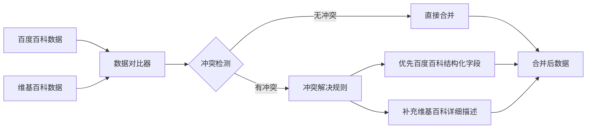

**冲突解决规则**：
- 时间信息：优先采用百度百科的标准化时间格式
- 人物关系：两者取并集，去重后保存
- 详细描述：维基百科内容作为扩展信息
- 数据来源：记录每个字段的数据来源标识

### 3.2 爬取目标定义

#### 3.2.1 明朝数据范围

| 类别 | 内容 | 数量级 | 优先级 |
|------|------|--------|--------|
| 皇帝信息 | 16位皇帝完整信息 | 16条 | P0 |
| 重大事件 | 政治、军事、文化事件 | 200-300条 | P0 |
| 重要人物 | 文臣、武将、文学家、艺术家 | 500-800人 | P1 |
| 宗室成员 | 皇子、皇后、妃嫔 | 300-500人 | P2 |
| 次要人物 | 其他历史人物 | 1000+人 | P3 |

#### 3.2.2 数据实体模型

**皇帝实体**

| 字段名 | 数据类型 | 说明 | 示例 |
|--------|---------|------|------|
| emperor_id | 字符串 | 唯一标识 | "ming_emperor_001" |
| name | 字符串 | 姓名 | "朱元璋" |
| temple_name | 字符串 | 庙号 | "明太祖" |
| reign_title | 字符串 | 年号 | "洪武" |
| birth_date | 日期 | 出生日期 | "1328-10-21" |
| death_date | 日期 | 去世日期 | "1398-06-24" |
| reign_start | 日期 | 在位开始 | "1368-01-23" |
| reign_end | 日期 | 在位结束 | "1398-06-24" |
| reign_duration | 整数 | 在位年数 | 30 |
| biography | 文本 | 生平简介 | 长文本 |
| achievements | 文本 | 主要成就 | 长文本 |
| dynasty_order | 整数 | 朝代顺序 | 1 |
| data_source | 字符串 | 数据来源 | "baidu,wiki" |

**事件实体**

| 字段名 | 数据类型 | 说明 | 示例 |
|--------|---------|------|------|
| event_id | 字符串 | 唯一标识 | "ming_event_001" |
| title | 字符串 | 事件名称 | "靖难之役" |
| event_type | 枚举 | 事件类型 | "military"（政治/军事/文化/经济/外交） |
| start_date | 日期 | 开始日期 | "1399-07-05" |
| end_date | 日期 | 结束日期 | "1402-07-13" |
| emperor_id | 字符串 | 关联皇帝 | "ming_emperor_002" |
| location | 字符串 | 发生地点 | "北京" |
| description | 文本 | 事件描述 | 长文本 |
| significance | 文本 | 历史意义 | 长文本 |
| related_persons | JSON数组 | 相关人物ID列表 | ["person_001", "person_002"] |
| data_source | 字符串 | 数据来源 | "baidu,wiki" |

**人物实体**

| 字段名 | 数据类型 | 说明 | 示例 |
|--------|---------|------|------|
| person_id | 字符串 | 唯一标识 | "ming_person_001" |
| name | 字符串 | 姓名 | "郑和" |
| alias | JSON数组 | 别名、字号 | ["三宝太监", "马和"] |
| birth_date | 日期 | 出生日期 | "1371-01-01" |
| death_date | 日期 | 去世日期 | "1433-01-01" |
| person_type | 枚举 | 人物类型 | "military"（文臣/武将/文学家/艺术家/宗室/其他） |
| position | 字符串 | 主要职位 | "钦差正使" |
| biography | 文本 | 生平简介 | 长文本 |
| style | 文本 | 风格特点 | 长文本（适用于文学家、艺术家） |
| works | JSON数组 | 代表作品 | ["航海图", "..."] |
| contributions | 文本 | 主要贡献 | 长文本 |
| related_emperors | JSON数组 | 关联皇帝ID | ["ming_emperor_003"] |
| data_source | 字符串 | 数据来源 | "baidu,wiki" |

### 3.3 爬虫技术设计

#### 3.3.1 爬虫架构

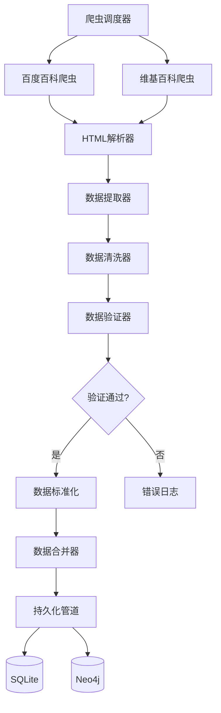

#### 3.3.2 爬虫组件说明

**百度百科爬虫**

- 目标URL模式：`https://baike.baidu.com/item/{关键词}`
- 解析策略：
  - 使用CSS选择器提取结构化信息框数据
  - 解析右侧信息卡片获取基础属性
  - 提取正文段落获取详细描述
  - 解析参考资料链接
- 反爬策略应对：
  - 设置随机User-Agent
  - 请求间隔延迟（2-5秒随机）
  - 使用Cookie池
  - IP代理池（可选）

**维基百科爬虫**

- 目标URL模式：`https://zh.wikipedia.org/wiki/{关键词}`
- 解析策略：
  - 解析Infobox模板获取结构化数据
  - 提取分类标签
  - 获取引用来源
  - 解析相关条目链接
- 特殊处理：
  - 处理繁简转换
  - 解析维基特有标记语法

**数据提取器**

定义提取规则映射表：

| 实体类型 | 百度百科提取规则 | 维基百科提取规则 |
|---------|----------------|----------------|
| 皇帝 | 信息框：本名、庙号、年号、在位时间 | Infobox: name, temple_name, reign |
| 事件 | 标题、时间、参与人物、事件经过 | title, date, participants, description |
| 人物 | 姓名、别名、生卒年、职业、代表作 | name, alias, birth_death, occupation, works |

**数据清洗器**

清洗规则：

| 清洗项 | 规则 | 示例 |
|--------|------|------|
| 时间格式 | 统一转换为ISO 8601格式 | "洪武元年" → "1368-01-23" |
| 文本去噪 | 移除HTML标签、特殊字符、引用标记 | "\[1\]" → "" |
| 空值处理 | 空字符串转为NULL | "" → null |
| 重复去除 | 数组字段去重 | ["张三", "张三"] → ["张三"] |
| 关系提取 | 从文本中提取人物关系 | "跟随朱棣" → 关系记录 |

**数据验证器**

验证规则：

| 验证项 | 规则 | 错误处理 |
|--------|------|---------|
| 必填字段 | emperor_id, name, reign_start等 | 记录警告，标记为不完整 |
| 时间逻辑 | 出生 < 登基 < 去世 | 记录错误，人工审核 |
| 日期范围 | 明朝时间范围1368-1644 | 记录错误，人工审核 |
| 引用完整性 | emperor_id在事件中必须存在 | 创建占位符或跳过 |
| 数据类型 | 日期格式、数值范围 | 类型转换或记录错误 |

#### 3.3.3 爬取流程

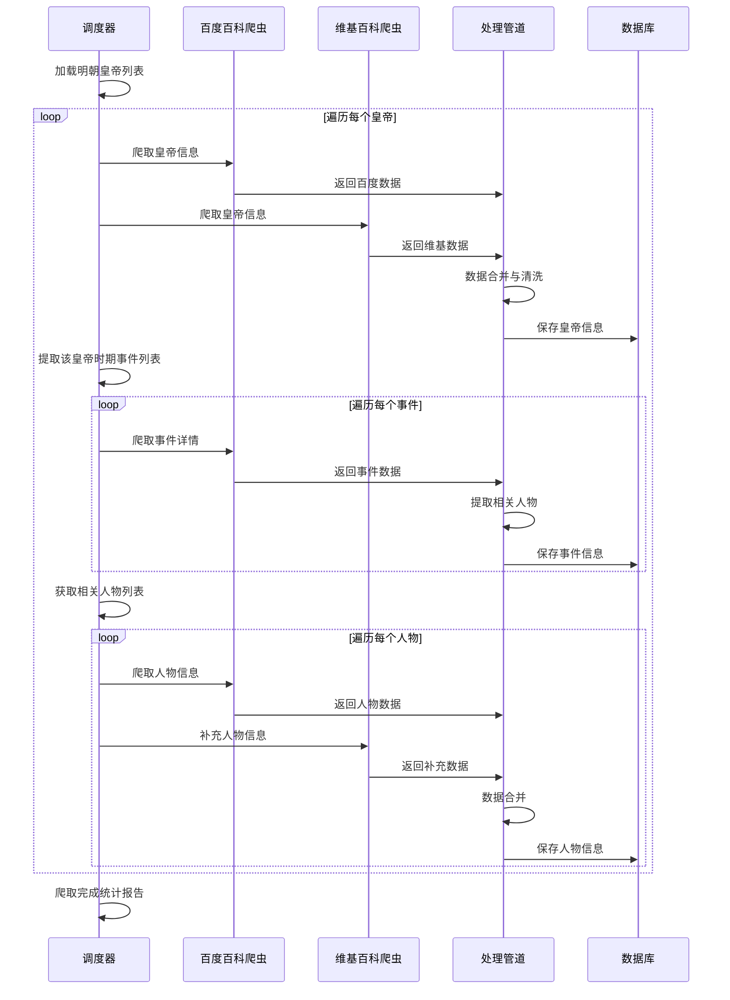

### 3.4 数据持久化设计

#### 3.4.1 持久化管道

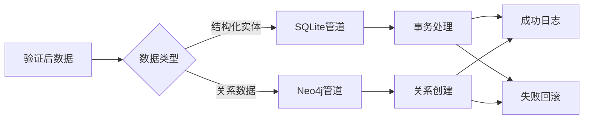

**SQLite持久化策略**

- 批量插入优化：每100条记录提交一次事务
- 冲突处理：使用UPSERT策略（存在则更新，不存在则插入）
- 索引策略：为常用查询字段创建索引
- 完整性约束：外键约束延迟检查

**Neo4j持久化策略**

- 节点创建：先创建实体节点，再建立关系
- 关系类型：定义明确的关系类型（RULED_BY, PARTICIPATED_IN, RELATED_TO等）
- 属性存储：关系上可存储权重、时间等属性
- 批量导入：使用Cypher批量导入语句优化性能

### 3.5 爬虫配置管理

**爬虫参数配置表**

| 配置项 | 默认值 | 说明 |
|--------|--------|------|
| CONCURRENT_REQUESTS | 8 | 并发请求数 |
| DOWNLOAD_DELAY | 3 | 请求延迟（秒） |
| RETRY_TIMES | 3 | 重试次数 |
| TIMEOUT | 30 | 超时时间（秒） |
| USER_AGENT_ROTATION | True | 是否轮换UA |
| COOKIE_ENABLED | True | 是否启用Cookie |
| LOG_LEVEL | INFO | 日志级别 |
| DATA_VALIDATION | True | 是否启用验证 |

### 3.6 错误处理与日志

**错误分类与处理**

| 错误类型 | 处理策略 | 日志级别 |
|---------|---------|---------|
| 网络超时 | 重试3次，失败后跳过 | WARNING |
| 页面不存在 | 跳过，记录到失败列表 | INFO |
| 解析失败 | 保存原始HTML，人工审核 | ERROR |
| 数据验证失败 | 标记为待审核，继续处理 | WARNING |
| 数据库写入失败 | 回滚事务，记录错误 | ERROR |

**日志记录内容**

- 爬取进度：已完成/总数、成功率
- 数据质量：完整性评分、缺失字段统计
- 性能指标：平均响应时间、吞吐量
- 异常记录：错误URL、失败原因

## 四、数据存储模块设计

### 4.1 混合存储架构

采用SQLite和Neo4j混合存储方案，发挥各自优势：

| 数据库类型 | 存储内容 | 优势 | 使用场景 |
|-----------|---------|------|---------|
| SQLite | 实体的结构化属性数据 | 轻量级、零配置、事务支持 | 基础数据查询、列表展示 |
| Neo4j | 实体间的关系网络 | 图遍历高效、关系查询强大 | 关系图谱、人物关联分析 |

### 4.2 SQLite数据库设计

#### 4.2.1 表结构设计

**dynasties 朝代表**

| 字段名 | 类型 | 约束 | 说明 |
|--------|------|------|------|
| dynasty_id | TEXT | PRIMARY KEY | 朝代ID |
| name | TEXT | NOT NULL | 朝代名称 |
| start_year | INTEGER | NOT NULL | 起始年份 |
| end_year | INTEGER | NOT NULL | 结束年份 |
| capital | TEXT | | 国都 |
| founder | TEXT | | 开国皇帝 |
| description | TEXT | | 朝代简介 |
| created_at | DATETIME | DEFAULT CURRENT_TIMESTAMP | 创建时间 |
| updated_at | DATETIME | DEFAULT CURRENT_TIMESTAMP | 更新时间 |

**emperors 皇帝表**

| 字段名 | 类型 | 约束 | 说明 |
|--------|------|------|------|
| emperor_id | TEXT | PRIMARY KEY | 皇帝ID |
| dynasty_id | TEXT | FOREIGN KEY | 所属朝代 |
| name | TEXT | NOT NULL | 姓名 |
| temple_name | TEXT | | 庙号 |
| reign_title | TEXT | | 年号 |
| birth_date | DATE | | 出生日期 |
| death_date | DATE | | 去世日期 |
| reign_start | DATE | NOT NULL | 在位开始 |
| reign_end | DATE | | 在位结束 |
| reign_duration | INTEGER | | 在位年数 |
| dynasty_order | INTEGER | NOT NULL | 朝代内顺序 |
| biography | TEXT | | 生平简介 |
| achievements | TEXT | | 主要成就 |
| portrait_url | TEXT | | 画像URL |
| data_source | TEXT | | 数据来源 |
| created_at | DATETIME | DEFAULT CURRENT_TIMESTAMP | 创建时间 |
| updated_at | DATETIME | DEFAULT CURRENT_TIMESTAMP | 更新时间 |

**events 事件表**

| 字段名 | 类型 | 约束 | 说明 |
|--------|------|------|------|
| event_id | TEXT | PRIMARY KEY | 事件ID |
| dynasty_id | TEXT | FOREIGN KEY | 所属朝代 |
| emperor_id | TEXT | FOREIGN KEY | 关联皇帝 |
| title | TEXT | NOT NULL | 事件标题 |
| event_type | TEXT | NOT NULL | 事件类型 |
| start_date | DATE | NOT NULL | 开始日期 |
| end_date | DATE | | 结束日期 |
| location | TEXT | | 发生地点 |
| description | TEXT | | 事件描述 |
| significance | TEXT | | 历史意义 |
| casualty | TEXT | | 伤亡情况（军事事件） |
| result | TEXT | | 事件结果 |
| data_source | TEXT | | 数据来源 |
| created_at | DATETIME | DEFAULT CURRENT_TIMESTAMP | 创建时间 |
| updated_at | DATETIME | DEFAULT CURRENT_TIMESTAMP | 更新时间 |

**persons 人物表**

| 字段名 | 类型 | 约束 | 说明 |
|--------|------|------|------|
| person_id | TEXT | PRIMARY KEY | 人物ID |
| dynasty_id | TEXT | FOREIGN KEY | 所属朝代 |
| name | TEXT | NOT NULL | 姓名 |
| alias | TEXT | | 别名、字号（JSON数组） |
| birth_date | DATE | | 出生日期 |
| death_date | DATE | | 去世日期 |
| person_type | TEXT | NOT NULL | 人物类型 |
| position | TEXT | | 主要职位 |
| biography | TEXT | | 生平简介 |
| style | TEXT | | 风格特点 |
| contributions | TEXT | | 主要贡献 |
| portrait_url | TEXT | | 画像URL |
| data_source | TEXT | | 数据来源 |
| created_at | DATETIME | DEFAULT CURRENT_TIMESTAMP | 创建时间 |
| updated_at | DATETIME | DEFAULT CURRENT_TIMESTAMP | 更新时间 |

**works 作品表**

| 字段名 | 类型 | 约束 | 说明 |
|--------|------|------|------|
| work_id | TEXT | PRIMARY KEY | 作品ID |
| person_id | TEXT | FOREIGN KEY | 作者ID |
| title | TEXT | NOT NULL | 作品名称 |
| work_type | TEXT | | 作品类型（诗词/书法/绘画/著作） |
| creation_date | DATE | | 创作时间 |
| description | TEXT | | 作品描述 |
| content | TEXT | | 作品内容（诗词全文等） |
| image_url | TEXT | | 作品图片URL |
| created_at | DATETIME | DEFAULT CURRENT_TIMESTAMP | 创建时间 |

**event_person_relation 事件人物关联表**

| 字段名 | 类型 | 约束 | 说明 |
|--------|------|------|------|
| relation_id | TEXT | PRIMARY KEY | 关联ID |
| event_id | TEXT | FOREIGN KEY | 事件ID |
| person_id | TEXT | FOREIGN KEY | 人物ID |
| role | TEXT | | 角色描述 |
| created_at | DATETIME | DEFAULT CURRENT_TIMESTAMP | 创建时间 |

**person_relations 人物关系表**

| 字段名 | 类型 | 约束 | 说明 |
|--------|------|------|------|
| relation_id | TEXT | PRIMARY KEY | 关系ID |
| person_id_from | TEXT | FOREIGN KEY | 源人物ID |
| person_id_to | TEXT | FOREIGN KEY | 目标人物ID |
| relation_type | TEXT | NOT NULL | 关系类型（师生/君臣/父子/好友等） |
| description | TEXT | | 关系描述 |
| created_at | DATETIME | DEFAULT CURRENT_TIMESTAMP | 创建时间 |

#### 4.2.2 索引设计

| 表名 | 索引字段 | 索引类型 | 用途 |
|------|---------|---------|------|
| emperors | dynasty_id | 普通索引 | 按朝代查询皇帝 |
| emperors | reign_start, reign_end | 复合索引 | 时间范围查询 |
| events | emperor_id | 普通索引 | 查询皇帝相关事件 |
| events | start_date | 普通索引 | 时间线排序 |
| events | event_type | 普通索引 | 按类型筛选 |
| persons | person_type | 普通索引 | 按类型筛选人物 |
| persons | dynasty_id | 普通索引 | 按朝代查询人物 |

### 4.3 Neo4j图数据库设计

#### 4.3.1 节点类型定义

**Dynasty 朝代节点**

| 属性名 | 类型 | 说明 |
|--------|------|------|
| id | String | 朝代ID（同SQLite） |
| name | String | 朝代名称 |
| start_year | Integer | 起始年份 |
| end_year | Integer | 结束年份 |

**Emperor 皇帝节点**

| 属性名 | 类型 | 说明 |
|--------|------|------|
| id | String | 皇帝ID |
| name | String | 姓名 |
| temple_name | String | 庙号 |
| dynasty_order | Integer | 朝代内顺序 |

**Event 事件节点**

| 属性名 | 类型 | 说明 |
|--------|------|------|
| id | String | 事件ID |
| title | String | 事件标题 |
| event_type | String | 事件类型 |
| start_date | Date | 开始日期 |

**Person 人物节点**

| 属性名 | 类型 | 说明 |
|--------|------|------|
| id | String | 人物ID |
| name | String | 姓名 |
| person_type | String | 人物类型 |

#### 4.3.2 关系类型定义

| 关系类型 | 起始节点 | 目标节点 | 属性 | 说明 |
|---------|---------|---------|------|------|
| BELONGS_TO | Emperor/Event/Person | Dynasty | - | 归属关系 |
| RULED_BY | Dynasty | Emperor | reign_start, reign_end | 统治关系 |
| SUCCEEDED_BY | Emperor | Emperor | - | 皇位继承 |
| OCCURRED_DURING | Event | Emperor | - | 事件发生在某皇帝时期 |
| PARTICIPATED_IN | Person | Event | role | 人物参与事件 |
| SERVED_UNDER | Person | Emperor | position | 侍奉关系 |
| TEACHER_STUDENT | Person | Person | - | 师生关系 |
| FAMILY | Person | Person | relation_type | 家族关系（父子/兄弟/夫妻） |
| COLLEAGUE | Person | Person | - | 同僚关系 |
| FRIEND | Person | Person | - | 友谊关系 |
| ENEMY | Person | Person | - | 敌对关系 |
| CREATED | Person | Work | creation_date | 创作关系 |

#### 4.3.3 图模型示例

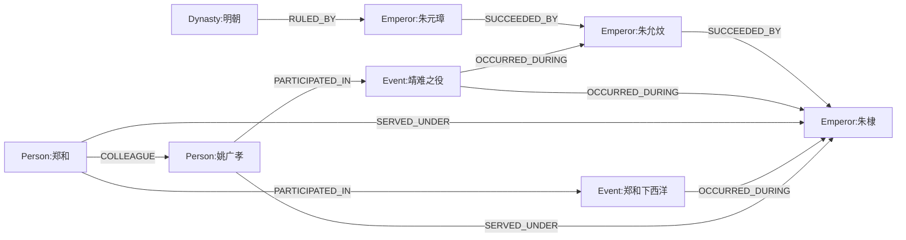

### 4.4 数据同步策略

SQLite与Neo4j数据保持同步的机制：

| 操作 | SQLite | Neo4j | 同步方式 |
|------|--------|-------|---------|
| 插入实体 | 先插入 | 后创建节点 | 事务提交后触发 |
| 更新实体 | 直接更新 | 同步更新节点属性 | 双写 |
| 删除实体 | 软删除（标记） | 删除节点及关系 | 级联删除 |
| 创建关系 | 插入关联表 | 创建关系边 | 双写 |
| 数据修复 | 以SQLite为准 | 重建图数据 | 定时任务 |

## 五、API服务模块设计

### 5.1 API架构设计

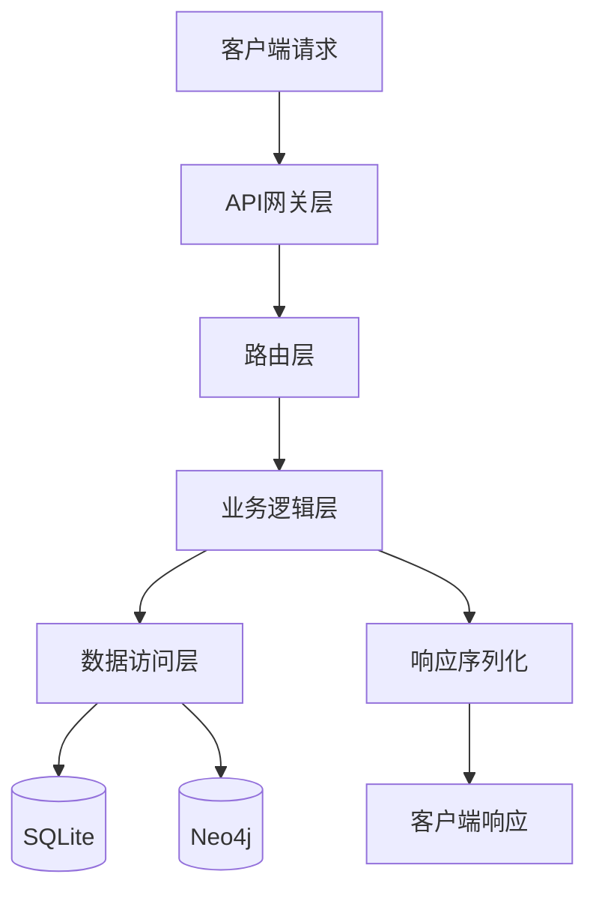

### 5.2 技术架构

**FastAPI框架选型理由**

- 高性能：基于Starlette和Pydantic，性能接近NodeJS和Go
- 自动文档：自动生成OpenAPI规范文档
- 类型验证：基于Python类型提示的自动验证
- 异步支持：原生支持async/await
- 易于测试：内置测试工具

### 5.3 API分层设计

#### 5.3.1 路由层（api/routes）

负责HTTP请求路由和参数验证

| 路由文件 | 路径前缀 | 功能 |
|---------|---------|------|
| dynasties.py | /api/v1/dynasties | 朝代相关接口 |
| emperors.py | /api/v1/emperors | 皇帝相关接口 |
| events.py | /api/v1/events | 事件相关接口 |
| persons.py | /api/v1/persons | 人物相关接口 |
| timeline.py | /api/v1/timeline | 时间线接口 |
| relations.py | /api/v1/relations | 关系图谱接口 |
| search.py | /api/v1/search | 搜索接口 |

#### 5.3.2 业务逻辑层（services）

处理业务逻辑和数据组装

| 服务类 | 职责 |
|--------|------|
| DynastyService | 朝代业务逻辑处理 |
| EmperorService | 皇帝信息处理、在位时间计算 |
| EventService | 事件筛选、排序、关联查询 |
| PersonService | 人物信息处理、作品关联 |
| TimelineService | 时间线数据组装、时间范围查询 |
| RelationService | 关系图谱查询、路径计算 |
| SearchService | 全文搜索、智能推荐 |

#### 5.3.3 数据访问层（repositories）

封装数据库操作

| 仓储类 | 数据库 | 职责 |
|--------|--------|------|
| DynastyRepository | SQLite | 朝代CRUD操作 |
| EmperorRepository | SQLite | 皇帝CRUD操作 |
| EventRepository | SQLite | 事件CRUD操作 |
| PersonRepository | SQLite | 人物CRUD操作 |
| GraphRepository | Neo4j | 图数据库查询 |

### 5.4 API接口定义

#### 5.4.1 朝代API

**获取朝代列表**

- 端点：`GET /api/v1/dynasties`
- 查询参数：无
- 响应数据：

| 字段 | 类型 | 说明 |
|------|------|------|
| code | Integer | 状态码 |
| message | String | 消息 |
| data | Array | 朝代列表 |
| data[].dynasty_id | String | 朝代ID |
| data[].name | String | 朝代名称 |
| data[].start_year | Integer | 起始年份 |
| data[].end_year | Integer | 结束年份 |
| data[].emperor_count | Integer | 皇帝数量 |

**获取朝代详情**

- 端点：`GET /api/v1/dynasties/{dynasty_id}`
- 路径参数：dynasty_id（朝代ID）
- 响应数据：

| 字段 | 类型 | 说明 |
|------|------|------|
| code | Integer | 状态码 |
| data | Object | 朝代详情 |
| data.dynasty_id | String | 朝代ID |
| data.name | String | 朝代名称 |
| data.description | String | 朝代简介 |
| data.emperors | Array | 皇帝列表（简要信息） |

#### 5.4.2 皇帝API

**获取皇帝列表**

- 端点：`GET /api/v1/emperors`
- 查询参数：

| 参数 | 类型 | 必填 | 说明 |
|------|------|------|------|
| dynasty_id | String | 否 | 筛选朝代 |
| page | Integer | 否 | 页码，默认1 |
| page_size | Integer | 否 | 每页数量，默认20 |

- 响应数据：

| 字段 | 类型 | 说明 |
|------|------|------|
| code | Integer | 状态码 |
| data | Object | 分页数据 |
| data.total | Integer | 总数 |
| data.items | Array | 皇帝列表 |
| data.items[].emperor_id | String | 皇帝ID |
| data.items[].name | String | 姓名 |
| data.items[].temple_name | String | 庙号 |
| data.items[].reign_start | String | 在位开始 |
| data.items[].reign_end | String | 在位结束 |

**获取皇帝详情**

- 端点：`GET /api/v1/emperors/{emperor_id}`
- 路径参数：emperor_id（皇帝ID）
- 查询参数：

| 参数 | 类型 | 必填 | 说明 |
|------|------|------|------|
| include_events | Boolean | 否 | 是否包含相关事件，默认false |
| include_persons | Boolean | 否 | 是否包含相关人物，默认false |

- 响应数据：

| 字段 | 类型 | 说明 |
|------|------|------|
| code | Integer | 状态码 |
| data | Object | 皇帝详情（完整字段） |
| data.events | Array | 相关事件（可选） |
| data.persons | Array | 相关人物（可选） |

#### 5.4.3 事件API

**获取事件列表**

- 端点：`GET /api/v1/events`
- 查询参数：

| 参数 | 类型 | 必填 | 说明 |
|------|------|------|------|
| dynasty_id | String | 否 | 筛选朝代 |
| emperor_id | String | 否 | 筛选皇帝 |
| event_type | String | 否 | 事件类型 |
| start_date | String | 否 | 起始日期 |
| end_date | String | 否 | 结束日期 |
| page | Integer | 否 | 页码 |
| page_size | Integer | 否 | 每页数量 |
| sort_by | String | 否 | 排序字段，默认start_date |
| sort_order | String | 否 | 排序方向（asc/desc），默认asc |

- 响应数据：分页事件列表

**获取事件详情**

- 端点：`GET /api/v1/events/{event_id}`
- 响应数据：完整事件信息及相关人物列表

#### 5.4.4 人物API

**获取人物列表**

- 端点：`GET /api/v1/persons`
- 查询参数：

| 参数 | 类型 | 必填 | 说明 |
|------|------|------|------|
| dynasty_id | String | 否 | 筛选朝代 |
| person_type | String | 否 | 人物类型 |
| page | Integer | 否 | 页码 |
| page_size | Integer | 否 | 每页数量 |

- 响应数据：分页人物列表

**获取人物详情**

- 端点：`GET /api/v1/persons/{person_id}`
- 查询参数：

| 参数 | 类型 | 必填 | 说明 |
|------|------|------|------|
| include_works | Boolean | 否 | 是否包含作品，默认false |
| include_events | Boolean | 否 | 是否包含参与事件，默认false |
| include_relations | Boolean | 否 | 是否包含人物关系，默认false |

- 响应数据：完整人物信息及可选关联数据

**获取人物作品**

- 端点：`GET /api/v1/persons/{person_id}/works`
- 响应数据：该人物的所有作品列表

#### 5.4.5 时间线API

**获取时间线数据**

- 端点：`GET /api/v1/timeline`
- 查询参数：

| 参数 | 类型 | 必填 | 说明 |
|------|------|------|------|
| dynasty_id | String | 是 | 朝代ID |
| start_date | String | 否 | 起始日期 |
| end_date | String | 否 | 结束日期 |
| event_types | String | 否 | 事件类型，逗号分隔 |
| granularity | String | 否 | 时间粒度（year/month/day），默认year |

- 响应数据：

| 字段 | 类型 | 说明 |
|------|------|------|
| code | Integer | 状态码 |
| data | Object | 时间线数据 |
| data.dynasty | Object | 朝代信息 |
| data.emperors | Array | 皇帝时间段 |
| data.events | Array | 事件列表（按时间排序） |
| data.timeline | Array | 时间刻度数据 |

**时间线数据结构示例**

```
data.timeline = [
  {
    "date": "1368",
    "events": [
      {
        "event_id": "...",
        "title": "明朝建立",
        "type": "political"
      }
    ],
    "emperor": {
      "emperor_id": "...",
      "name": "朱元璋",
      "reign_year": 1
    }
  },
  ...
]
```

#### 5.4.6 关系图谱API

**获取人物关系图谱**

- 端点：`GET /api/v1/relations/person/{person_id}`
- 查询参数：

| 参数 | 类型 | 必填 | 说明 |
|------|------|------|------|
| depth | Integer | 否 | 关系深度，默认2 |
| relation_types | String | 否 | 关系类型过滤，逗号分隔 |
| max_nodes | Integer | 否 | 最大节点数，默认50 |

- 响应数据：

| 字段 | 类型 | 说明 |
|------|------|------|
| code | Integer | 状态码 |
| data | Object | 图谱数据 |
| data.nodes | Array | 节点列表 |
| data.edges | Array | 边列表 |

**节点数据结构**

| 字段 | 类型 | 说明 |
|------|------|------|
| id | String | 节点ID |
| label | String | 节点标签（名称） |
| type | String | 节点类型 |
| properties | Object | 节点属性 |

**边数据结构**

| 字段 | 类型 | 说明 |
|------|------|------|
| source | String | 源节点ID |
| target | String | 目标节点ID |
| relation_type | String | 关系类型 |
| properties | Object | 关系属性 |

**查找两人关系路径**

- 端点：`GET /api/v1/relations/path`
- 查询参数：

| 参数 | 类型 | 必填 | 说明 |
|------|------|------|------|
| from_person_id | String | 是 | 起始人物ID |
| to_person_id | String | 是 | 目标人物ID |
| max_depth | Integer | 否 | 最大深度，默认5 |

- 响应数据：返回最短关系路径

#### 5.4.7 搜索API

**全局搜索**

- 端点：`GET /api/v1/search`
- 查询参数：

| 参数 | 类型 | 必填 | 说明 |
|------|------|------|------|
| q | String | 是 | 搜索关键词 |
| type | String | 否 | 搜索类型（emperor/event/person/all），默认all |
| dynasty_id | String | 否 | 限定朝代 |
| limit | Integer | 否 | 结果数量，默认20 |

- 响应数据：

| 字段 | 类型 | 说明 |
|------|------|------|
| code | Integer | 状态码 |
| data | Object | 搜索结果 |
| data.emperors | Array | 匹配的皇帝 |
| data.events | Array | 匹配的事件 |
| data.persons | Array | 匹配的人物 |
| data.total | Integer | 总匹配数 |

### 5.5 数据模型（Schemas）

使用Pydantic定义请求和响应模型

**基础响应模型**

| 字段 | 类型 | 说明 |
|------|------|------|
| code | Integer | 状态码（200成功，400客户端错误，500服务器错误） |
| message | String | 消息 |
| data | Any | 响应数据 |

**分页响应模型**

| 字段 | 类型 | 说明 |
|------|------|------|
| total | Integer | 总记录数 |
| page | Integer | 当前页码 |
| page_size | Integer | 每页数量 |
| total_pages | Integer | 总页数 |
| items | Array | 数据列表 |

### 5.6 错误处理

**HTTP状态码使用规范**

| 状态码 | 场景 | 示例 |
|--------|------|------|
| 200 | 成功 | 查询成功 |
| 201 | 创建成功 | 添加新记录 |
| 400 | 请求参数错误 | 缺少必填参数 |
| 404 | 资源不存在 | 皇帝ID不存在 |
| 500 | 服务器错误 | 数据库连接失败 |

**错误响应格式**

| 字段 | 类型 | 说明 |
|------|------|------|
| code | Integer | 错误码 |
| message | String | 错误消息 |
| details | Object | 详细错误信息（可选） |

### 5.7 性能优化策略

| 优化项 | 实现方案 |
|--------|---------|
| 缓存策略 | 使用Redis缓存热点数据（皇帝列表、朝代信息） |
| 数据库连接池 | 配置合理的连接池大小 |
| 分页查询 | 所有列表接口强制分页，避免大量数据传输 |
| 字段选择 | 支持fields参数，按需返回字段 |
| 压缩传输 | 启用Gzip压缩 |
| 异步处理 | 充分利用FastAPI的异步特性 |

### 5.8 API文档

FastAPI自动生成交互式API文档：

- Swagger UI：`http://localhost:8000/docs`
- ReDoc：`http://localhost:8000/redoc`
- OpenAPI规范：`http://localhost:8000/openapi.json`

## 六、iOS客户端设计

### 6.1 客户端架构设计

#### 6.1.1 MVVM架构

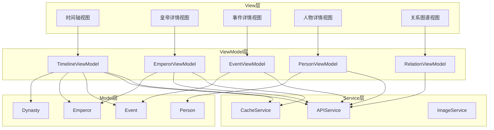

#### 6.1.2 SOLID原则应用

**单一职责原则（SRP）**

- 每个ViewModel只负责一个功能模块
- Model只包含数据结构，不包含业务逻辑
- Service层专注于网络请求、缓存、图片加载等具体功能

**开闭原则（OCP）**

- 使用协议（Protocol）定义接口，便于扩展
- 新增朝代数据时无需修改现有代码

**里氏替换原则（LSP）**

- 所有Service遵循协议定义，可互相替换
- Mock Service用于测试环境

**接口隔离原则（ISP）**

- 定义细粒度的协议，避免臃肿接口
- 如：Fetchable、Cacheable、Refreshable

**依赖倒置原则（DIP）**

- ViewModel依赖Service协议，而非具体实现
- 通过依赖注入管理依赖关系

### 6.2 核心模块设计

#### 6.2.1 数据模型层（Models）

**Dynasty模型**

| 属性 | 类型 | 说明 |
|------|------|------|
| id | String | 朝代ID |
| name | String | 朝代名称 |
| startYear | Int | 起始年份 |
| endYear | Int | 结束年份 |
| capital | String? | 国都 |
| description | String? | 简介 |

**Emperor模型**

| 属性 | 类型 | 说明 |
|------|------|------|
| id | String | 皇帝ID |
| name | String | 姓名 |
| templeName | String? | 庙号 |
| reignTitle | String? | 年号 |
| birthDate | Date? | 出生日期 |
| deathDate | Date? | 去世日期 |
| reignStart | Date | 在位开始 |
| reignEnd | Date? | 在位结束 |
| biography | String? | 生平 |
| portraitURL | URL? | 画像URL |

**Event模型**

| 属性 | 类型 | 说明 |
|------|------|------|
| id | String | 事件ID |
| title | String | 标题 |
| eventType | EventType | 事件类型 |
| startDate | Date | 开始日期 |
| endDate | Date? | 结束日期 |
| location | String? | 地点 |
| description | String? | 描述 |
| significance | String? | 意义 |
| relatedPersons | [Person]? | 相关人物 |

**Person模型**

| 属性 | 类型 | 说明 |
|------|------|------|
| id | String | 人物ID |
| name | String | 姓名 |
| alias | [String]? | 别名 |
| birthDate | Date? | 出生 |
| deathDate | Date? | 去世 |
| personType | PersonType | 类型 |
| biography | String? | 生平 |
| style | String? | 风格 |
| contributions | String? | 贡献 |
| works | [Work]? | 作品 |

**枚举类型定义**

| 枚举 | 值 |
|------|-----|
| EventType | political, military, cultural, economic, diplomatic |
| PersonType | official, general, writer, artist, royal, other |

#### 6.2.2 服务层（Services）

**APIService协议**

定义网络请求接口：

| 方法 | 功能 | 返回类型 |
|------|------|---------|
| fetchDynasties() | 获取朝代列表 | async throws -> [Dynasty] |
| fetchEmperors(dynastyId:) | 获取皇帝列表 | async throws -> [Emperor] |
| fetchEmperorDetail(id:) | 获取皇帝详情 | async throws -> Emperor |
| fetchEvents(filter:) | 获取事件列表 | async throws -> [Event] |
| fetchPersons(filter:) | 获取人物列表 | async throws -> [Person] |
| fetchTimeline(dynastyId:) | 获取时间线数据 | async throws -> Timeline |
| fetchRelationGraph(personId:) | 获取关系图谱 | async throws -> RelationGraph |
| searchGlobal(keyword:) | 全局搜索 | async throws -> SearchResult |

**CacheService协议**

本地缓存管理：

| 方法 | 功能 |
|------|------|
| save<T>(key:value:) | 保存数据 |
| load<T>(key:) | 读取数据 |
| remove(key:) | 删除数据 |
| clear() | 清空缓存 |

缓存策略：

- 朝代列表：永久缓存（很少变化）
- 皇帝列表：缓存7天
- 详情数据：缓存1天
- 图片：缓存30天

**ImageService协议**

图片加载与缓存：

| 方法 | 功能 |
|------|------|
| loadImage(url:) | 异步加载图片 |
| cacheImage(url:image:) | 缓存图片 |
| clearImageCache() | 清理图片缓存 |

#### 6.2.3 视图模型层（ViewModels）

**TimelineViewModel**

| 属性 | 类型 | 说明 |
|------|------|------|
| dynasty | Dynasty? | 当前朝代 |
| emperors | [Emperor] | 皇帝列表 |
| events | [Event] | 事件列表 |
| timelineData | [TimelineItem] | 时间线数据 |
| isLoading | Bool | 加载状态 |
| errorMessage | String? | 错误信息 |

| 方法 | 功能 |
|------|------|
| loadTimeline(dynastyId:) | 加载时间线 |
| filterEvents(type:) | 筛选事件类型 |
| selectDate(date:) | 选择日期 |

**EmperorViewModel**

| 属性 | 类型 | 说明 |
|------|------|------|
| emperor | Emperor? | 皇帝数据 |
| relatedEvents | [Event] | 相关事件 |
| relatedPersons | [Person] | 相关人物 |
| isLoading | Bool | 加载状态 |

| 方法 | 功能 |
|------|------|
| loadEmperorDetail(id:) | 加载皇帝详情 |
| loadRelatedData() | 加载关联数据 |

**EventViewModel**

| 属性 | 类型 | 说明 |
|------|------|------|
| event | Event? | 事件数据 |
| participants | [Person] | 参与人物 |

**PersonViewModel**

| 属性 | 类型 | 说明 |
|------|------|------|
| person | Person? | 人物数据 |
| works | [Work] | 作品列表 |
| relations | RelationGraph? | 关系图谱 |

**RelationViewModel**

| 属性 | 类型 | 说明 |
|------|------|------|
| centerPerson | Person? | 中心人物 |
| nodes | [GraphNode] | 图节点 |
| edges | [GraphEdge] | 图边 |

### 6.3 视图层设计

#### 6.3.1 主要视图

**DynastyListView - 朝代选择视图**

功能：
- 展示所有朝代列表
- 点击进入该朝代的时间线

设计要点：
- 使用卡片式布局
- 每个朝代卡片显示：朝代名称、时间跨度、皇帝数量
- 采用历史风格的配色和字体

**TimelineView - 时间轴主视图**

功能：
- 垂直时间轴展示历史脉络
- 显示皇帝在位时间段
- 标注重大事件
- 可滚动浏览整个朝代

设计要点：
- 采用垂直滚动时间线
- 左侧显示时间刻度（年份）
- 中间显示皇帝时间段（色块）
- 右侧显示事件标记点
- 点击皇帝/事件可查看详情

时间线布局示意：

```
年份    |  皇帝           |  事件
--------|----------------|--------
1368    |  ┌───────────┐ |  ● 明朝建立
        |  │           │ |
1370    |  │  朱元璋   │ |  ● 胡惟庸案
        |  │  (洪武)   │ |
1380    |  │           │ |  ● 废除丞相
        |  └───────────┘ |
1398    |  ┌───────────┐ |  ● 建文帝登基
        |  │  朱允炆   │ |
1399    |  │  (建文)   │ |  ● 靖难之役
```

**EmperorDetailView - 皇帝详情视图**

功能：
- 显示皇帝完整信息
- 展示画像
- 列出在位期间重大事件
- 展示相关人物

设计要点：
- 顶部：画像 + 基本信息（姓名、庙号、年号、在位时间）
- 中部：生平简介、主要成就（可折叠）
- 底部：相关事件列表、相关人物列表（横向滚动）

**EventDetailView - 事件详情视图**

功能：
- 显示事件完整信息
- 展示参与人物
- 显示历史意义

设计要点：
- 头部：事件标题、类型标签、时间地点
- 中部：事件描述
- 底部：参与人物卡片列表

**PersonDetailView - 人物详情视图**

功能：
- 显示人物完整信息
- 展示作品列表
- 显示人物关系图谱

设计要点：
- 头部：画像 + 基本信息
- 中部：生平、风格、贡献（Tab切换）
- 底部：作品列表（网格布局）
- 浮动按钮：查看关系图谱

**RelationGraphView - 关系图谱视图**

功能：
- 可视化展示人物关系网络
- 支持缩放、拖拽
- 点击节点查看详情

设计要点：
- 使用力导向图布局
- 不同类型关系用不同颜色连线
- 节点大小表示重要程度
- 支持手势交互（缩放、平移）

**SearchView - 搜索视图**

功能：
- 全局搜索
- 分类展示结果
- 搜索历史

设计要点：
- 顶部搜索框
- 搜索建议下拉列表
- 结果分类（皇帝/事件/人物）Tab
- 搜索历史快速访问

#### 6.3.2 导航结构

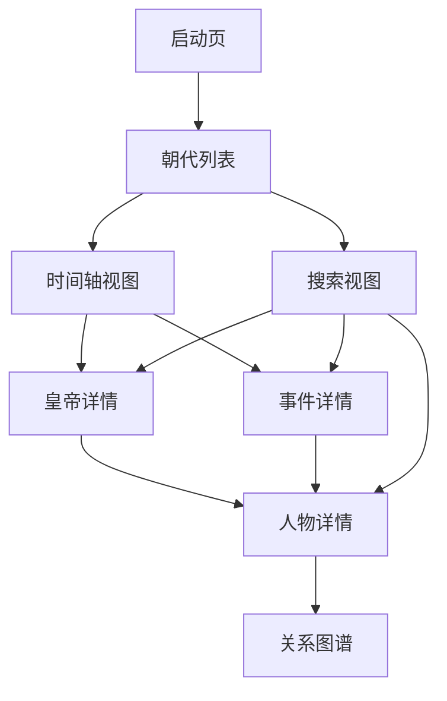

导航方式：
- 使用NavigationView实现层级导航
- 底部TabBar：时间轴、搜索、设置
- 侧滑返回手势

### 6.4 UI设计风格

#### 6.4.1 历史主题设计原则

**色彩方案**

| 用途 | 颜色 | 说明 |
|------|------|------|
| 主色调 | 故宫红 #8B0000 | 突出历史感 |
| 辅助色 | 青铜绿 #4A7C59 | 古典元素 |
| 背景色 | 宣纸白 #F5F5DC | 文雅质感 |
| 文字色 | 墨黑 #2C2C2C | 易读性 |
| 强调色 | 金黄 #DAA520 | 重要信息标注 |

**字体选择**

| 用途 | 字体 | 大小范围 |
|------|------|---------|
| 标题 | 华文楷体 / PingFang SC Bold | 24-32pt |
| 正文 | PingFang SC Regular | 14-16pt |
| 辅助信息 | PingFang SC Light | 12pt |
| 时间标注 | PingFang SC Medium | 13pt |

**视觉元素**

- 使用传统纹样作为装饰（云纹、回纹）
- 卡片边框采用中式边框样式
- 分隔线使用细线条，体现简约
- 图标设计融入中国元素

#### 6.4.2 交互设计

**手势交互**

| 手势 | 功能 |
|------|------|
| 上下滑动 | 浏览时间线 |
| 点击 | 查看详情 |
| 长按 | 收藏或分享 |
| 双指缩放 | 关系图谱缩放 |
| 侧滑 | 返回上级 |

**动画效果**

| 场景 | 动画 | 时长 |
|------|------|------|
| 页面切换 | 滑入滑出 | 0.3s |
| 卡片展开 | 渐变展开 | 0.25s |
| 数据加载 | 骨架屏 | - |
| 关系图谱 | 节点弹出 | 0.4s |

### 6.5 数据流设计

#### 6.5.1 数据加载流程

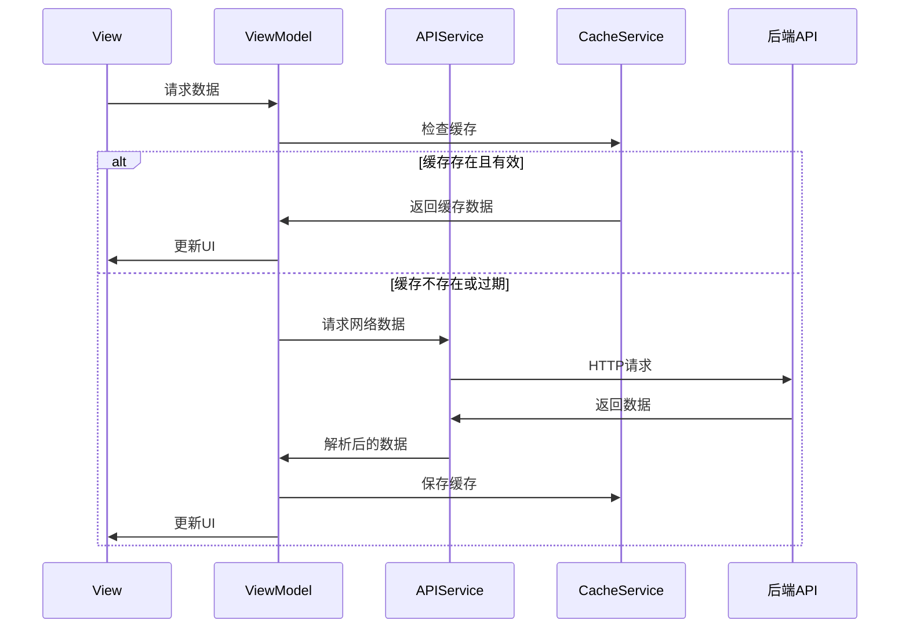

#### 6.5.2 错误处理流程

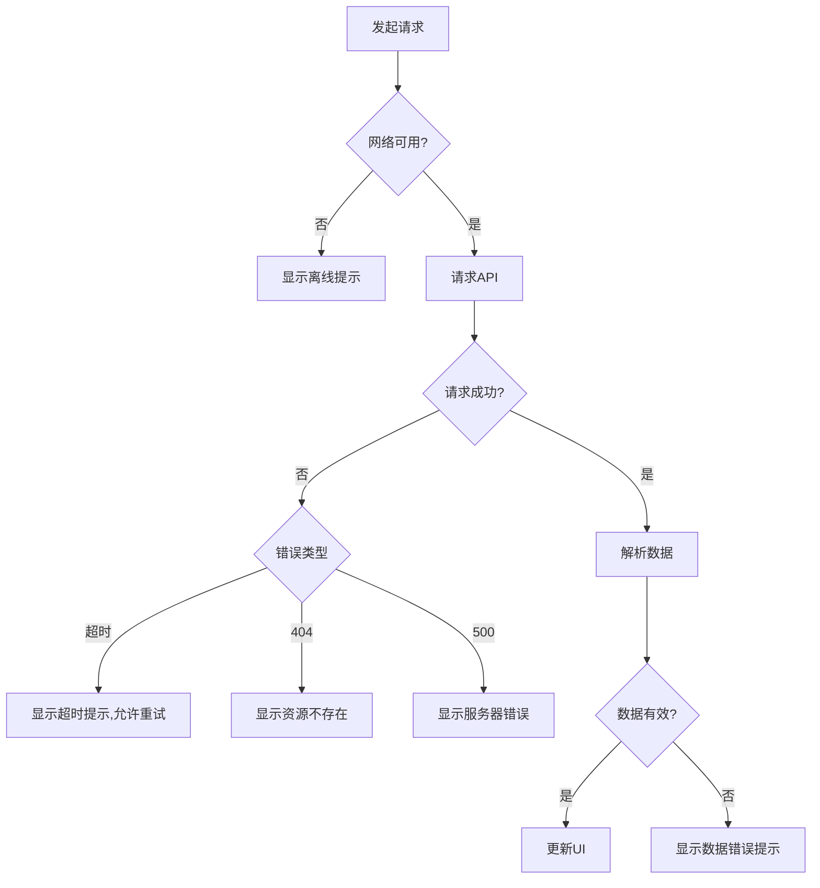

### 6.6 性能优化

#### 6.6.1 列表优化

| 优化项 | 实现方案 |
|--------|---------|
| 懒加载 | 使用LazyVStack，按需渲染 |
| 分页加载 | 滚动到底部时加载下一页 |
| 图片优化 | 异步加载，缩略图预览 |
| 缓存复用 | Cell重用机制 |

#### 6.6.2 内存优化

| 优化项 | 实现方案 |
|--------|---------|
| 图片缓存 | 限制缓存大小，LRU淘汰策略 |
| 大数据处理 | 后台线程处理，避免主线程阻塞 |
| 及时释放 | 离开页面时释放大对象 |

#### 6.6.3 网络优化

| 优化项 | 实现方案 |
|--------|---------|
| 请求合并 | 批量请求API |
| 增量更新 | 仅请求变化的数据 |
| 压缩传输 | 启用Gzip |
| 离线支持 | 缓存关键数据，离线可浏览 |

### 6.7 测试策略

#### 6.7.1 单元测试

测试覆盖：
- Model数据解析测试
- ViewModel业务逻辑测试
- Service接口测试（使用Mock）

#### 6.7.2 UI测试

测试场景：
- 页面导航流程
- 数据加载状态
- 错误处理展示
- 手势交互

#### 6.7.3 集成测试

测试重点：
- 完整的用户操作流程
- 网络异常场景
- 数据一致性

## 七、项目实施计划

### 7.1 开发阶段划分

**阶段一：数据爬取与存储（预计4周）**

| 周次 | 任务 | 交付物 |
|------|------|--------|
| 第1周 | 环境搭建、爬虫框架搭建、百度百科爬虫实现 | 可运行的百度百科爬虫 |
| 第2周 | 维基百科爬虫实现、数据清洗与验证模块 | 双源爬虫完整实现 |
| 第3周 | SQLite数据库设计与实现、Neo4j图数据库设计 | 数据库初始化脚本 |
| 第4周 | 数据持久化、明朝数据全量爬取、数据质量验证 | 完整的明朝结构化数据 |

**阶段二：API服务开发（预计3周）**

| 周次 | 任务 | 交付物 |
|------|------|--------|
| 第5周 | FastAPI框架搭建、数据访问层实现、基础API | 朝代、皇帝API |
| 第6周 | 事件、人物API、时间线API、关系图谱API | 完整API接口 |
| 第7周 | 搜索功能、性能优化、API文档完善、测试 | 可部署的API服务 |

**阶段三：iOS客户端开发（预计6周）**

| 周次 | 任务 | 交付物 |
|------|------|--------|
| 第8周 | 项目搭建、Model层、Service层、网络请求封装 | 基础架构 |
| 第9周 | 朝代列表、时间轴视图、皇帝详情视图 | 核心视图 |
| 第10周 | 事件详情、人物详情、作品展示 | 详情页面 |
| 第11周 | 关系图谱视图、搜索功能 | 高级功能 |
| 第12周 | UI优化、动画效果、主题适配 | UI完善 |
| 第13周 | 性能优化、Bug修复、测试、发布准备 | 可发布版本 |

### 7.2 技术风险与应对

| 风险 | 等级 | 应对措施 |
|------|------|---------|
| 百科网站反爬 | 高 | 降低爬取频率、使用代理、准备备用数据源 |
| 数据质量不佳 | 中 | 多源数据验证、人工审核机制 |
| 关系图谱性能 | 中 | 限制节点数量、优化图算法、客户端缓存 |
| iOS适配问题 | 低 | 使用SwiftUI适配多尺寸、充分测试 |

### 7.3 后续扩展方向

**数据扩展**

- 逐步增加其他朝代（唐、宋、清等）
- 补充更多人物作品详情
- 增加历史地图数据

**功能扩展**

- 历史知识问答
- 用户收藏和笔记功能
- 历史事件对比分析
- 社交分享功能

**平台扩展**

- Android客户端开发
- Web端开发
- 小程序版本

## 八、数据质量保障

### 8.1 数据质量指标

| 指标 | 目标值 | 检测方式 |
|------|--------|---------|
| 数据完整性 | >95% | 必填字段检查 |
| 数据准确性 | >98% | 多源对比验证 |
| 时间逻辑性 | 100% | 时间关系校验 |
| 引用完整性 | 100% | 外键约束检查 |

### 8.2 数据审核机制

**自动审核**

- 字段完整性检查
- 数据格式验证
- 逻辑关系校验
- 重复数据检测

**人工审核**

- 关键人物信息复核
- 重大事件描述审查
- 数据冲突人工判断
- 周期性抽查

### 8.3 数据更新机制

| 更新类型 | 频率 | 触发方式 |
|---------|------|---------|
| 数据补充 | 按需 | 手动触发 |
| 数据修正 | 发现即改 | 人工提交 |
| 全量更新 | 半年 | 定时任务 |

## 九、附录

### 9.1 技术选型对比

**爬虫框架对比**

| 框架 | 优势 | 劣势 | 选择理由 |
|------|------|------|---------|
| Scrapy | 功能强大、生态丰富 | 学习曲线陡峭 | ✓ 适合复杂爬虫项目 |
| BeautifulSoup | 简单易用 | 功能单一 | ✓ 辅助HTML解析 |
| Requests | 轻量灵活 | 需自行处理异步 | 辅助简单请求 |

**数据库对比**

| 数据库 | 类型 | 优势 | 选择理由 |
|--------|------|------|----------|
| SQLite | 关系型 | 零配置、轻量、事务支持 | ✓ 存储结构化实体数据 |
| Neo4j | 图数据库 | 关系查询高效、图遍历强大 | ✓ 存储人物关系网络 |
| MySQL | 关系型 | 功能强大、支持大数据 | 未选择（项目初期数据量小） |
| MongoDB | 文档型 | 灵活的Schema | 未选择（需要严格的数据结构） |

**API框架对比**

| 框架 | 性能 | 特点 | 选择理由 |
|------|------|------|----------|
| FastAPI | 高 | 异步、自动文档、类型验证 | ✓ 现代化、高性能 |
| Flask | 中 | 轻量、灵活 | 未选择（缺少异步支持） |
| Django | 中 | 全功能、ORM强大 | 未选择（过于重量级） |

### 9.2 数据字典

**事件类型枚举**

| 值 | 中文名称 | 说明 |
|-----|---------|------|
| political | 政治事件 | 政治改革、政权更迭等 |
| military | 军事事件 | 战争、战役、军事行动 |
| cultural | 文化事件 | 文化运动、重要著作出版 |
| economic | 经济事件 | 经济政策、贸易活动 |
| diplomatic | 外交事件 | 外交活动、国际关系 |
| natural | 自然灾害 | 地震、洪水、旱灾等 |
| technological | 科技事件 | 科技发明、工程建设 |

**人物类型枚举**

| 值 | 中文名称 | 说明 |
|-----|---------|------|
| official | 文臣 | 朝廷文官 |
| general | 武将 | 军事将领 |
| writer | 文学家 | 诗人、作家、戏曲家 |
| artist | 艺术家 | 画家、书法家、音乐家 |
| thinker | 思想家 | 哲学家、教育家 |
| scientist | 科学家 | 天文、数学、医学等 |
| royal | 宗室 | 皇室成员 |
| monk | 僧侣 | 佛教、道教人士 |
| merchant | 商人 | 商业人士 |
| other | 其他 | 其他类型人物 |

**关系类型枚举**

| 值 | 中文名称 | 方向性 | 说明 |
|-----|---------|--------|------|
| father_son | 父子 | 有向 | 父亲→儿子 |
| brothers | 兄弟 | 无向 | 兄弟关系 |
| husband_wife | 夫妻 | 无向 | 婚姻关系 |
| teacher_student | 师生 | 有向 | 老师→学生 |
| emperor_minister | 君臣 | 有向 | 皇帝→大臣 |
| friends | 好友 | 无向 | 友谊关系 |
| colleagues | 同僚 | 无向 | 同事关系 |
| enemies | 敌对 | 无向 | 敌对关系 |
| master_apprentice | 师徒 | 有向 | 师傅→徒弟（技艺传承） |

### 9.3 API响应示例

**获取时间线数据响应示例**

```json
{
  "code": 200,
  "message": "success",
  "data": {
    "dynasty": {
      "dynasty_id": "ming",
      "name": "明朝",
      "start_year": 1368,
      "end_year": 1644
    },
    "emperors": [
      {
        "emperor_id": "ming_emperor_001",
        "name": "朱元璋",
        "temple_name": "明太祖",
        "reign_title": "洪武",
        "reign_start": "1368-01-23",
        "reign_end": "1398-06-24",
        "dynasty_order": 1
      }
    ],
    "events": [
      {
        "event_id": "ming_event_001",
        "title": "明朝建立",
        "event_type": "political",
        "start_date": "1368-01-23",
        "emperor_id": "ming_emperor_001",
        "description": "朱元璋在应天府称帝，国号大明，年号洪武"
      }
    ],
    "timeline": [
      {
        "year": 1368,
        "events": [
          {
            "event_id": "ming_event_001",
            "title": "明朝建立",
            "type": "political"
          }
        ],
        "emperor": {
          "emperor_id": "ming_emperor_001",
          "name": "朱元璋",
          "reign_year": 1
        }
      }
    ]
  }
}
```

**获取关系图谱响应示例**

```json
{
  "code": 200,
  "message": "success",
  "data": {
    "nodes": [
      {
        "id": "ming_person_001",
        "label": "郑和",
        "type": "Person",
        "properties": {
          "person_type": "general",
          "birth_date": "1371-01-01"
        }
      },
      {
        "id": "ming_emperor_003",
        "label": "朱棣",
        "type": "Emperor",
        "properties": {
          "temple_name": "明成祖"
        }
      }
    ],
    "edges": [
      {
        "source": "ming_person_001",
        "target": "ming_emperor_003",
        "relation_type": "SERVED_UNDER",
        "properties": {
          "position": "钦差正使"
        }
      }
    ]
  }
}
```

### 9.4 环境配置要求

**开发环境**

| 组件 | 版本要求 | 说明 |
|------|---------|------|
| Python | 3.9+ | 爬虫和API服务 |
| SQLite | 3.35+ | 内置，无需单独安装 |
| Neo4j | 4.4+ | 图数据库 |
| Xcode | 14.0+ | iOS开发 |
| Swift | 5.0+ | iOS开发语言 |
| iOS SDK | 15.0+ | 最低支持iOS 15 |

**Python依赖包**

| 包名 | 版本 | 用途 |
|------|------|------|
| scrapy | 2.8+ | 爬虫框架 |
| beautifulsoup4 | 4.11+ | HTML解析 |
| fastapi | 0.95+ | API框架 |
| uvicorn | 0.21+ | ASGI服务器 |
| pydantic | 1.10+ | 数据验证 |
| sqlalchemy | 2.0+ | ORM框架 |
| neo4j | 5.7+ | Neo4j驱动 |
| requests | 2.28+ | HTTP客户端 |
| python-dateutil | 2.8+ | 日期处理 |

**服务器配置建议**

| 配置项 | 最低配置 | 推荐配置 |
|--------|---------|----------|
| CPU | 2核 | 4核 |
| 内存 | 4GB | 8GB |
| 存储 | 20GB | 50GB |
| 带宽 | 1Mbps | 5Mbps |

### 9.5 安全考虑

**API安全**

| 安全措施 | 实现方案 |
|---------|----------|
| 访问控制 | API Key验证（可选，初期可不实现） |
| 请求限流 | 限制单IP请求频率，防止滥用 |
| HTTPS | 生产环境强制HTTPS |
| 输入验证 | 所有参数进行类型和范围验证 |
| SQL注入防护 | 使用ORM，参数化查询 |

**爬虫合规**

- 遵守robots.txt协议
- 合理控制爬取频率，避免对目标网站造成压力
- 尊重版权，标注数据来源
- 仅用于学习和非商业用途

**隐私保护**

- 不收集用户个人信息（初期版本）
- 本地缓存数据加密存储（可选）
- 符合相关数据保护法规

### 9.6 参考资源

**技术文档**

- FastAPI官方文档：https://fastapi.tiangolo.com/
- Scrapy官方文档：https://docs.scrapy.org/
- Neo4j文档：https://neo4j.com/docs/
- Swift官方文档：https://swift.org/documentation/
- SwiftUI官方教程：https://developer.apple.com/tutorials/swiftui

**数据来源**

- 百度百科：https://baike.baidu.com/
- 中文维基百科：https://zh.wikipedia.org/

**设计灵感**

- 故宫博物院数字展厅
- 中国国家博物馆APP
- Timeline类历史应用

---

**文档版本**: v1.0  
**创建日期**: 2024  
**最后更新**: 2024| Scrapy | 功能强大、生态丰富 | 学习曲线陡峭 | ✓ 适合复杂爬虫项目 |
